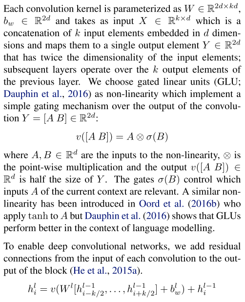
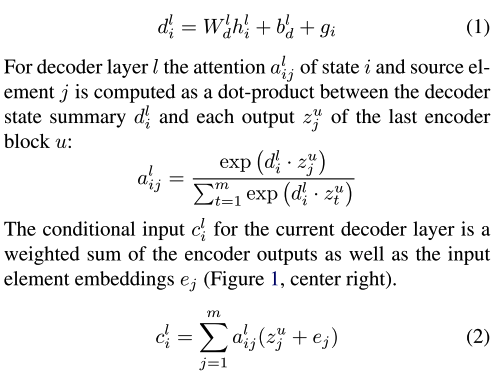

### Title
Convolutional Sequence to Sequence Leaarning

### Authors
Jonas Gehring, Michael Auli, David Grangier, Denis Yarats, Yann N. Dauphin

### link
[Arxiv](http://arxiv.org/abs/1003.0146)
[Github](https://github.com/facebookresearch/fairseq)

### Contents
- A Convolutional Architecture
  1. Position Embeddings
    - input element: **x** = $\(x_1, x_2, .., x_m)$
    - distributional space **w** = $\(w_1, ..., w_m)$, $\w_i$ is f dimension vector
    - Embedding matrix D (V*f dim)
    - position **p** = (p_1, ..., p_m), p_i is f dimension vector transformed from its absolute position
    - input **e** = (w_1 + p+1, ..., w_m + p_m)
  1. Convolutional Block Structure 
    - embedded feature(**e**)를 가지고 처음에 작업
    - 
    - 처음에 $\x_1$넣으면 $\h_1^l(1)$이 나오겠지
    - repeat while l < 6
    - 윗 부분은 convolution layer 부분임
    - 저 마지막 h_i^l를 사용해서 y_i+1 예측(softmax layer)
  1. Multi-step Attention
    - 
    - $\d_i$는 현재 상태 나타내는 vector
    - attention은 encoder에서 나온 feature들($\z_t^u)와 d를 이용해서..
    - 구해진 conditional input(attentioned vector) c를 가지고 2에 있는 convolution 반복
    - 다음 단어 예측
    

### 느낀점
  - cnn구조로 chatbot을 만들어도 잘 통할까?
  - notation이 일관적이지 않고 그림에도 문자가 안적혀있어서 내가 맞게 이해한건지 모르겠음
  - 코드를 시간나면 좀 뜯어봐야 할 듯
  - torch도 공부를 좀 해야겠다..
