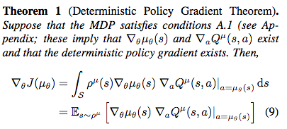
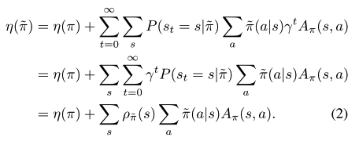
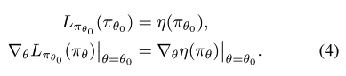
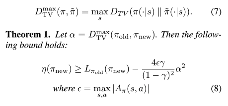
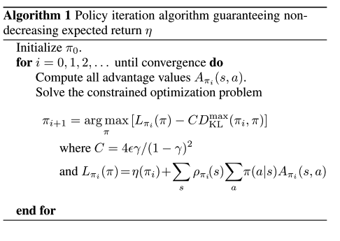
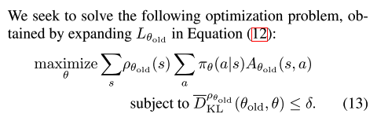
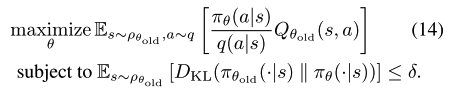

### Title
Deep Reinforcement Learning: An Overview

### Authors
Yuxi Li

### link
[arxiv](https://arxiv.org/pdf/1701.07274.pdf)

### Contents
1. Introduction
    - sequential decision making 문제 해결에 사용
    - breakthroughs: 너무 많아서 정리하기도 힘들다.. 여기 있는걸 다 하나씩 짚어준다니 논문을 읽어가면서 정리합시다
1. background
    - Neural Network
        - 간단하게 옛날 neural network부터 cnn, rnn, dropout, batch normalization 이런 이야기
    - Reinforcement Learning
        - $\pi\$(a_t|t), R(s, a), P(s_t+1|s_t, a_t) -> policy, reward, transition probability
        - value function, action-value function -> TD learning/ Q-learning or SARSA
        - 위의 function을 neural network로 근사하는게 deep Q-Network류
        - policy based methods는 policy를 바로 구하기, REINFORCE, actor-critic
    - Testbeds
        - Arcade Learning Environment, DeepMind Lab, OpenAI Gym, OpenAI Universe, FAIR TorchCraft, ViZDoom, TORCS, MuJoCo
1. Deep Q-Network
    - Mnih et al(2015) -> 아타리 게임 논문
    - Experience replay: 그냥 online learning하는게 아니고 순서를 막 섞어서 minibatch 만들어서 자료 사이의 연관성 낮추고 학습 안정화. 중요한/드문 자료는 학습에 여러번 쓸 수 있음
    - Double DQN: deep q-learning은 parameter update 과정에서 value값을 overestimate하는 경향이 있음, 두 개의 network 만들어서 하나는 greegy policy가 뭔지 찾도록 하고 나머지 하나는 value update하도록. 
    - Prioritized experience replay: experience replay에서 important experience가 더 자주 나올 수 있도록 -> td error기반으로(아마도 이게 크면 더 자주 나오도록 하겠지? 자세한건 내일 논문 읽어보고 다시 내용 덧붙이도록 하자)
    - dueling architecture: state value function과 advantage function을 예측하는 network 만들고 action value function 추정-> Q-learning보다 더 빨리 수렴(이것도 네트워크 구조 좀 더 자세히 봐야할 것 같음, 원래 q-learning에서는 action value function만을 approximation하는데 value function도 예측하게 해서 noise를 줄이는 효과가 있는 것으로 아마도 예상함)
1. Asyncronous methods
    - parallel actors employ different exploration policies to stabilize training, so that experience replay is not utilized
    <table>
    <tr>
        <td>
            # 전체 모형 파라미터와 thread specific(asynchronous workers) 파라미터 초기화  
            Global shared parameter vectors θ and θ_v, thread-specific parameter vectors θ′ and θ′_v  
            Global shared counter T = 0, T_max 
            Initialize step counter t←1  
            for T ≤ Tmax do 
                # thread별로 같은 파라미터에서 시작하도록 초기화 
                &emsp;Reset gradients, dθ ←0 and dθv ←0  
                &emsp;Synchronize thread-specific parameters θ′ = θ and θ′_v = θv 
                &emsp;Set t_start = t, get state s_t 
                # policy따라서 state value를 리워드로 얻음
                &emsp;for s_t not terminal and t−tstart ≤ tmax do 
                    &emsp;&emsp;&emsp;Take at according to policy π(at|st; θ′) 
                    &emsp;&emsp;&emsp;Receive reward rt and new state st+1 
                    &emsp;&emsp;&emsp;t←t+1, T ←T +1 
                &emsp;end 
                &emsp;R = 0 for terminal s_t | V (st, θ′ v) otherwise 
                &emsp;for i ∈ {t−1, ..., tstart} do  
                    # 서로 다른 thread에서 얻어진 gradient를 축적해서 main policy, value업데이트하는데 사용. 서로 다른 탐색을 thread마다 하니까 속도도 빠르고 안정화가 쉬움 
                    &emsp;&emsp;&emsp;R←ri +γR 
                    &emsp;&emsp;&emsp;accumulate gradients wrt θ′: dθ ←dθ +∇θ′log π(a_i|s_i; θ′)(R−V (s_i; θ′_v)) 
                    &emsp;&emsp;&emsp;accumulate gradients wrt θ′_v v: dθ_v ←dθ_v +∇θ′ (R −V (si; θ′v))^2 
                &emsp;end 
                &emsp;Update asynchronously θ using dθ, and θv using dθ_v
            end
        </td>
    </tr>
    </table>
1. policy optimization
    - deterministic policy gradient
        - stochastic policy gradient는 state/action space 모두에 대해 고려해야 하지만 deterministic policy gradient는 state만 신경쓰면 됨(action은 state에 따라 불변할거니까)
        - In continuous action spaces, greedy policy improvement becomes problematics
        - the policy parameters θ^(k+1)are updated in proportion to the gradient ∇_θQ^μ^k(s,μ_θ(s))
        - parameter가 변하면서 내가 움직인 후 결정되는 next state가 높은 value값을 보장해주면 parameter +방향으로 update..
        - 만일 next state가 높은 reward를 안주면 그 쪽으로 안가게 되겠지 -> intuition
        - deterministic poliy gradient
        
        - 참고자료: [link](http://pemami4911.github.io/blog/2016/08/21/ddpg-rl.html)
    - Trust Region Policy Optimization
        
        - policy iteration method
        - 식 2의 제일 마지막 부분에서 모든 s에 대해서 새로운 policy에 따라 행동했을 때에 expected advantage(sigma pi{tilda}(a|s)A_{pi}(s, a))가 0보다 크거나 같으면 policy performance는 업데이트 이후 좋아짐
        - 
        - deterministic policy argmax를 따라가면 policy improvement는 보장됨
        - approximation에서는 문제..
        - Lπ(˜π) = η(π)+sigma{}{s}*ρπ(s)sigma{}{a}*π(a|s)Aπ(s, a).
        - visitation frequency는 업데이트 전 pi를 따르는걸로(sample 통한 approximation 쉬워짐) 
        
        - gradient ascent를 적절한 step으로 하면 새로운 정책 좋게 업데이트 하는 것 가능
        - Monotomic Improvement Guarantee for General Stochastic Policies
            
            - (total variation divergence)^2 <= KL divergence임을 이용해서
            
        - Optimization of Parameterized policies
            
            - pi가 theta에 의해 parameterized
            - 여기에 importance sampling/ sample expectation 적용
            - github link: [link](https://github.com/wojzaremba/trpo)
            - slides: [link](https://media.nips.cc/Conferences/2016/Slides/6198-Slides.pdf), [link2](http://joschu.net/docs/2016-NIPS-Tutorial.pdf)
        - Practical Algorithms
            
            - 위의 식 update할 때 conjugate gradient 사용함
1. reward
    - Inverse reinforcement learning: 어떻게 reward function을 정할 것인가?
    - Generative Adversarial Imitation Learning
        - Discriminator가 expert policy와 imitation policy를 구분 못하게 하도록 imitation policy를 학습시키기
        - 아이디어는 simple 간단하네
        - expert 자료가 많은 상황에서는 충분히 써먹을 수 있는 방법일 것 같음
1. Planning

        