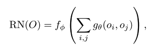

### Title
A simple neural network module for relational reasoning

### Authors
Adam Santoro, David Raposo, David G.T. Barrett, Mateusz alinowski, Razvan Pascanu, Peter Battaglia, Timothy Lillicrap

### link
[arxiv](https://arxiv.org/pdf/1706.01427.pdf)

### Contents
- the form of the Relational Network

- O = {o_1, o_2, ...} <- a set of objects, object can be a structured description or anything(In pixel RN model, each object is k*1*1 tensor from k*d*d convolved image and In natural language RN model, each object is LSTM encoded description sentence)
- f, g: MLPs
- f-MLP의 마지막 layer는 정답 단어 예측하는 softmax, loss는 softmax loss사용
- 질문을 concatenation하지말고 o_i, o_j를 elementwise product한 이후에 filter처럼 사용해서 conditioning할 수는 없을까?
