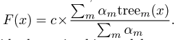
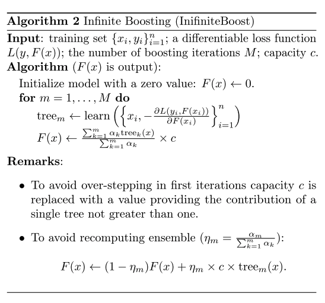

### Title
InfiniteBoost: building infinite ensembles with gradient descent

### Authors
Alex Rogozhnikov, Tatiana Likhomanenko

### link
[Download link](https://arxiv.org/pdf/1706.01109.pdf)

### Contents
1. Introduction
    - Random forest의 장점: the generalization error for frests converges to a limit as the number of trees in the forest becomes large. overfitting에 강한 면모를 보임
    - Gradient Boosting의 장점: the next tree can account mistakes of previously constructed trees in the ensemble, residuals y − F(x) are the negative gradients of the squared error loss function 1/2*(y − F(x))^2. So, gradient boosting is a gradient descent algorithm; and generalizing it entails "plugging in" a different loss and its gradient.
    - InfiniteBoost: construction of an infinite ensemble and at the same time accounting the mistakes of previously constructed trees in the sensemble with a gradient descent method
1. InfiniteBoost
    - desired properties: build an infinite converging ensemble and encounter the errors made by trees using gradient boosting approach
    
    - 각 tree의 contribution은 zero로 수렴
    
    - Gradient Boosting과의 차이점을 살펴보면 F(x)를 만드는 과정에서 이전 classifier들의 영향력이 점점 줄어든다는 점.
    - 아마 이게 기존 Gradient Boosing이랑은 다르게 tree들을 많이 합쳐도 training error가 무식하게 줄어드는 것을 막아주는 역할을 하는 것 같릉
    - 전체적으로 봤을 떄에 결과물이 random forest나 gradient boosting보다 압도적으로 좋은 것은 아님. 근데 이렇게 하면 random forest처럼 parallelization이 쉽게 되지는 않을 것 같은데(F(x)로 학습을 시키긴 해야하니까..) 이 점에서 속도가 더 느려지지는 않을지...
