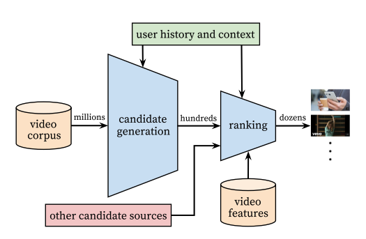

### Title
Deep Neural Networks for YouTube Recommendations

### Authors
Paul Covington, 
Jay Adams, 
Emre Sargin

### link
[Download link](http://static.googleusercontent.com/media/research.google.com/en//pubs/archive/45530.pdf)

### Contents
1. Introduction 
    - Youtube 추천은 쉽지 않음
        - 자료가 sparse, unstructured metadata, 실시간 자료 업로드, 굉장히 많은 자료들
        - deeplearning으로 하면 전통적인 방법보다 나을까?
        
    - Structures
        
        - candidate generation에서는 collaborative filtering통한 후보 정하기
            - 차원 축소를 위해서 embedding 사용
            - user 정보, context 정보 있을 때에 어떤 동영상을 볼 지 예측하는 모형을 만들어서 user, context embedding과 video embedding 만들었음
            - long tail 문제 / extremely many classes 문제 해결을 위해 importance sampling 사용
            - 비디오가 만들어진 시간도 변수로 넣음(사람들은 새로운 비디오를 좋아하기 때문에)
            - 현재 vector의 top N nearest neighbor 동영상 후보로 제공
        - ranking
            - feature engineering: 예전에 본 비디오, 사용자/비디오 언어/ 마지막으로 본 시간/ thumb up 등등 넣고 본 시간 예측
            - 시청 시간 기댓값 높은 비디오 X개 추천
            - A/B 테스팅 결과 이전의 item based cf보다 더 좋은 성능 거뒀음