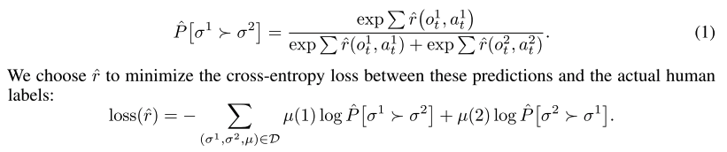

### Title
Deep Reinforcement Learning from Human Preferences

### Authors
Paul F Christiano, Jan Leike, Tom B Brown, Miljan Martic, Shane Legg, Dario Amodei

### link
[Download link](https://arxiv.org/pdf/1706.03741.pdf)

### Contents
1. Introduction 
    - 종종 어려운 문제들은 suitable reward function을 만들기가 어려움
    - 만일 demonstration이 있다면? inverse reinforcement learning으로 reward function 찾아서 이를 학습에 사용할 수 있음
    - human feedback: 사람을 몇 천 시간이나 붙잡고 보상이나 주게 하고 있을 수 있없음
    - 사람이 피드백 과정에 참여한다면 이렇게 되어야 함
        1. enables us to solve tasks for which we can only recognize the desired behavior, but not necessarily demonstrate it,
        2. allows agents to be taught by non-expert users, 
        3. scales to large problems, and 
        4. is economical with user feedback.
    - fits a reward function to the human's preferences while simultaneously training a policy to optimize the current predicted reward function
    
2. Preliminaries and Method
    - Setting and Goal
        - o_t, a_t(observation / action per time)
        - 원래의 reinforcement learning문제라면 r_t(reward per time)도 있고 discounted sum of rewards를 maximize하는 것이 목표임
        - 여기서는 trajectory segments에 대해 선호를 보이는 것으로 문제 변형
        - σ = ((o0, a0), (o1, a1), . . . , (ok−1, ak−1)) ∈ (O ×A)^k
        - monotonic transition of reward to preference
    - Method
        - policy와 reward function을 학습 -> deep neural network로
        - policy update: given r_hat, we use policy gradient to compromise using non-stationary reward function because policy gradient is usually robust to change in the reward function
        - preference elicitation: 두 개의 trajectory 보여주고(물론 위의 policy에서 생성된) 어떤 쪽을 더 선호하는지 물어봄
        - fitting reward function: latent reward가 있어서 선호 확률은 이거의 logit에 의해 결정되는 모형
        
    - 결과 봤을 때에 true reward를 썼을 때보다는 좀 못했지만 그래도 상당히 괜찮음
    - reward function을 정의하기가 힘든 분야라면 확실히 괜찮을 듯
    - preference elicitation에서도 둘 중 하나 선택하게 하는 방식이 확실히 괜찮은 것 같다. 하나만 보고 했다면 expert / non-expert 차이 컸을 듯