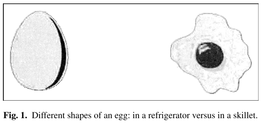
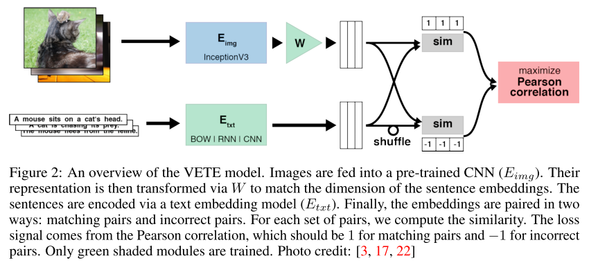

### Title
Better Text Understanding Through Image-To-Text Transfer

### Authors
Karol Kurach, Sylvain Gelly, Michal Jastrezebski,  Philip Haeusser, Olivier Teytaud, Damien Vincent, Olivier Bousquet

### link
[Download link](http://arxiv.org/abs/1705.08386)

### Contents
1. Introduction
    - training embeddings from pure text data -> there are many types of relations and cooccurences that are hard to grasp from pure text
    - shape simulation 효과 생각해보면 될 듯(zwaan et al,. 2002)
        - people activate perceptual symbols dufing language comprehension
        - Two sentences
            - The ranger saw the eagle in the sky
            - The ranger saw the eagle in its nest
        - 두 문장의 propositional property는 거의 유사함(문장 구조가 같으니)
        - 근데 의미적으로 보면 완전 다름. 날고 있는 새는 날개를 펴고 있을거고 둥지에 있으면 접고 있을거임
        
        - people activate and manipulate perceptual symbols during language comprehension such that an object's implied orientation, shape and more.
        - 글에서의 묘사와 형태가 일치하는 그림일 수록 빠르게/정확하게 반응함
    - Visually Enhanced Text Embeddings
2. VETE Models
    
    - text encoder: N-dim embedding. 단위는 단어, bow, rnn, cnn 세 개 사용. bow의 경우 단어들 평균으로. cnn은 convolutional layer 마지막 output
    - image encoder: Inception V3 network, 2048 dim feature for vector for each image in the dataset
    - 목표는 maximize sim(E_img(I), E_txt(S))
    - affine transformation W $/in/$ R^2048 * N. 이 파라미터도 학습 시에 배워야 함
    - 학습 시킬 때 batch에서 문장들 섞어서 다른 그림들과 매치시켜서 mismatch 조합 만들어냄. match인 경우 y(pearson correlation) = 1, mismatch인 경우 -1
3. 결과
    - 같은 이미지의 다른 caption들 embedding해서 similarity 계산
    - BOW가 word embedding중에서는 제일 나았음
    - 평가 결과 확실히 그냥 embedding보다는 좋고 결과물이 거의 역대 최고에 근접
    - 그림 feature와 같이 학습하는게 word embedding 학습할 때에도 도움이 되는거네
    