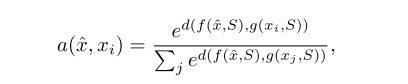
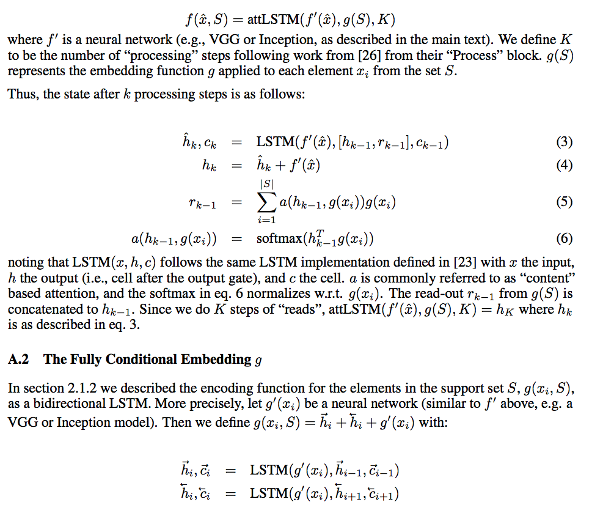

### Title
Cognitive Psychology for Deep Neural Networks: A Shape Bias Case Study

### Authors
Samuel Ritter, David G.T. Barrett, Adam Santoro, Matt M. Botvinick

### link
[Download link](https://arxiv.org/pdf/1706.08606.pdf)

### Contents
1. Introduction
    - developmental psychology에서 알려진 shape bias : The shape bias is the tendency of infants and children (as well as adults) to generalize information about an object by its shape, rather than its color, material, or texture when learning nouns.
2. Inductive Biases, Statistical Learners and Probe Datasets
    - Suppose we have some data {yi,xi}, i = 1, ..., N
    - where yi = f(xi)
    - Our goal is to build a model of the data g(.) to optimize some loss function L measuring the disparity between y and g(x), e.g., L = sum(||yi−g(xi)||2)
    - 왜 딥러닝이 이해가 어려운걸까? 예측에 사용되는 property h(x)가 사람이 이해하기에 너무 비직관적이기 때문
    - 이 논문에서 제안한건 h_p(x) property를 아마 모형이 활용할거라고 보고, 이 property를 사용했을 때에 모형이 보일 행동들을 예상해본 다음에 실제로 그렇게 되는지 보자는 것
    - 기계 대상으로 실험 + 가설검증
3. The problem of word learning; the solution of inductive biases
    - one-shot word learning은 가장 힘든 문제 중 하나
    - cognitive biases that enable children to eliminate broad swaths of the hypothesis space
        - whole object bias, taxonomic bias, the mutual exclusivity bias, the shape bias, ...
4. One-shot word learning models and training
    - 학습 자료가 한 클래스 당 하나씩만...
    - baseline: pretrained inception model의 마지막 레이어에서 나온 값, cosine similarity가 가장 가까운 값으로 labelling
    - Matching nets
        - 
        - 그 전 연구(Matching Nets)에서 사용한 LSTM 상세
        - 
        - d = cosine similarity
        - f, g: emage embedding
5. Shape bias in the various models
    - 일단 기본적으로 matching nets, baseline model 모두에서 그림 매칭 과제를 시켰을 때에 probe에 shape match 그림을 정답으로 하는 경우가 훨씬 많았음
    - 엄청 빠른 epoch time에 shape bias나타남
    - 기존에 많이 써먹던 image classifier에 저런 몰랐던 특성이..
    - black box 벗어나려고 하는건 알겠는데 솔직히 큰 의미가 있는지는 모르곘음.. 다 써먹을 데가 있어서 한 거겠지만