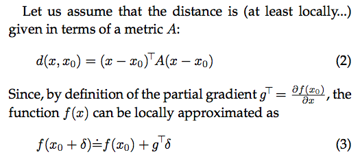
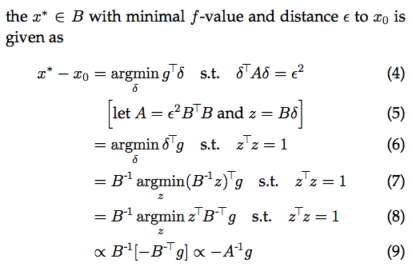

### Title
A Natural Policy Gradient

### Authors
Sham Kakade

### link
[Download link](https://papers.nips.cc/paper/2073-a-natural-policy-gradient.pdf)

### Contents
1. A Natural Gradient
    - steepest gradient descent의 stepsize issue
        - plain gradient descent는 stepsize가 gradient값에 따라서 결정됨
        - scale invariant한게 아님
        - direction은 타당하지만 stepsize에 관해서는 robust한 값이 아님
    - KL divergence: 얼마나 두 분포가 서로 유사한지
    - 같은 parameterization, 같은 input, 결과값으로 나온 확률이 차이가 많이남 -> KL divergence값이 큼
    - parameter space에서 같은 거리만큼 떨어져있는 parameter set, 이 중 loss function을 minimize하는 것
    - 기존 모형과 그다지 많이 차이가 나지 않으면서도 안정적으로 모형 업데이트 가능
    - 어떤 방식으로 parameterization하는가도 업데이트에 영향을 주지 않음
    - natural gradient
    
    - distance가 epsilon이란 제약조건 안에서 loss minimization하는 x*는 아래와 같음
    
    - metric A가 주어졌다면 covariant gradient descent는 -(A^(-1))g 형태 -> A가 Fisher Information metric일 때 natural gradient라고 부르기도 함
    - policy gradient에서 policy update에서도 natural gradient를 쓰는게 natural policy gradient의 아이디어

- 공부할 내용: TRPO와의 연결점 및 발전 내용 알아보기(대충 보기로는 TRPO는 whole fisher information matrix를 안구해도 된다는 장점이 있는 것 같은데 방법을 좀 자세히 알아두면 좋을 듯)