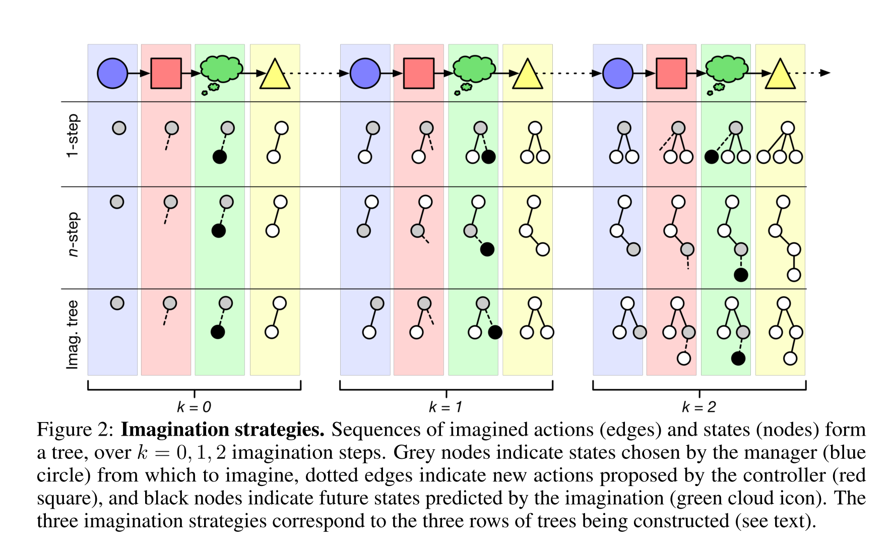

### Title
Learning model-based planning from scratch

### Authors
Razvan Pascanu∗, Yujia Li∗, Oriol Vinyals, Nicolas Heess,
Lars Buesing, Sebastien Racanière, David Reichert,ThéophaneWeber, DaanWierstra, Peter Battaglia

### link
[Download link](https://arxiv.org/pdf/1707.06170.pdf)

### Contents
1. Introduction
    - model-based planning: proposing sequences of actions, evaluating them under a model of the world, and refining these proposals to optimize expected rewards
    - 근데 사실 어떻게 plan을 만든다는건지는 모형에서 안알랴줌. 평가 부분만 있을 뿐
    - imagination-based planner: 여기서 만든 모형으로 construct, evaluate, execute plan을 전부 다 할 수 있음

1. Model
    - 구성요소
        - manager: 현재 상황에서 imagine할지 act할지 선택하는 장치
        - controller: 행동을 생성(act에서는 실제로 할 행동을, imagine에서는 imagination 평가로 생성된 행동)
        - imagination: 
        - memory: 행동들(action / imagine) 저장
    - 매 iteration i마다 행동 / 상상, 행동은 j로 indexing, 상상은 k로 indexing
    - planning / acting하면서 두 종류의 data 생셩됨
        - external data: world state s_j, executed action a_j, obtained reward r_j
        - internal data: imagined state s_(j,k), actions a_(j,k), rewards r_(j,k), manager's decision whether to act or imagine u_(j,k), 
        - 한 iteration에 생겨난 두 데이터 모아서 d_i
        - h_i = (d_0, ..., d_i)
    - manager πM : H → P는 discrete policy which maps a history h to a route u, U = {act, s_(j,0), . . . , s_(j,k)}, act를 선택하면 실제 행동하는게 되는거고 state들 선택하면 저 상태에서 imagine 시작하라는거
    - controller πC : S×H → A는 manager에서 골라진 상태(act면 그냥 s_j)와 history 활용해서 action 선택
    - imagination I : S×A → S×R은 state, action있으면 다음 state와 action의 결과인 reward 만들어내는 model
    - memory는 그냥 데이터들 누적되는 저장소
    - three distinct imagination-based planning strategies
    
        - 1-step: 무조건 현상황 s_(j,0)에서 상상
        - n-step: 제일 마지막으로 상상했던 상황 s_(j,k)에서 상상
        - tree: 예전에 상상했던 어떤 상황에서든 상상 가능

<!--stochastic value gradients, interaction network 찾아보자-->
1. Experiment 1: Continuous Control(spaceship tasks)
    - memory는 LSTM으로 구현, hi = µ(di,hi−1), h_i를 이용해서 c_i라는 plan context 만들어냄
    - manager, controller는 MLP
    - manager는 c_i-1, s_j를 input으로 받아서 p_(j,k) output으로
    - controller는 s_(j,p_(j,k))와 c_i−1 받아서 action 생성
    - imagination은 s, a받아서 다음 s 만들어내는 interaction network
    - 두 종류의 loss minimization: external task, internal resource losses
        - external loss는 기름 사용량, 모선과의 거리 등
        - internal resource loss: imagination 많이 하면 늘어나는 loss, manager에만 영향줌
    - 현재 state만 보고 행동을 결정하는게 아닌 plan context에 얼마나 많은 미래정보를 줘서 좋은 행동을 만들어내게 하는가 // 이게 새로운 점
    