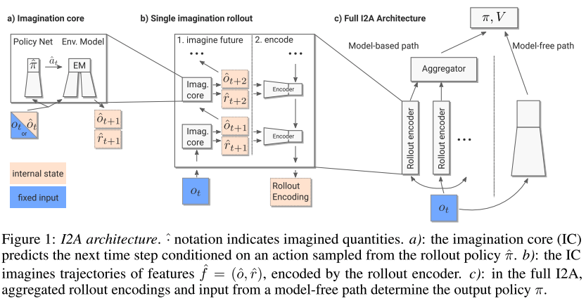

### Title
Imagination-Augmented Agents for Deep Reinforcement Learning

### Authors

### link
[Download link](http://arxiv.org/abs/1707.06203)

### Contents
1. The I2A architecture
    
    - 그림 a부분
        - environment model: given information from the present, can be queried to make predictions about the future
        - 말이 어렵게 느껴지지만 현재 state와 action에서 reward와 다음 state를 예상하는 모형
        - action-conditional next-step predictors
        - roll out the environmet model over multiple time steps into the future by initializing the imagined trajectory with the present time real observation, and subsequently feeding simulated observations into the model
        - 상상에서 나온 예측 state를 다시 environment model에 넣어서 계속적으로 더 미래의 상황을 상상하도록
    - 그림 b부분
        - 사실 이렇게 만들어진 environment model은 erroneous할 수 있음
        - rollout encoder: 이렇게 만들어진 imagined rollout을 받아서 하나의 imagination embedding으로 만드는 기능
        - interpret the imagined sequences
        - sequences에서 유용한 정보만을 추출할 수 있도록
    - 그림 c부분
        - 여러개의 rollout embedding을 통틀어서 하나의 imagination code로 만드는 aggregator
        - 예전 논문의 planning context에 해당하는 부분
        - 이것과 현재 상황 바탕으로 앞으로 행동 만들어내는 model-free network

1. Architectural choices and experimental setup
    1. rollout strategy
        - for each ith rollout, the first action taken is a_i -> 여러개 rollout 해볼 때에 첫 시작은 서로다른 i의 행동으로 시작하도록(탐색의 다양성을 위해서)
        - 그 다음에는 rollout policy ˆπ에 의해 결정
    1. I2A components and environment models
        - rollout encoder는 imagination trajectory 역으로 넣어주는 LSTM encoder
        - model-free path는 convolutional neural network
        - 마지막에 fully connected layer -> value
        - environment agent는 pretrain
        - pretrain을 위한 data는 partially trained standard model-free agent에서 나온 state, reward들
        - 위의 모델은 baseline으로도 사ㄷ용됨