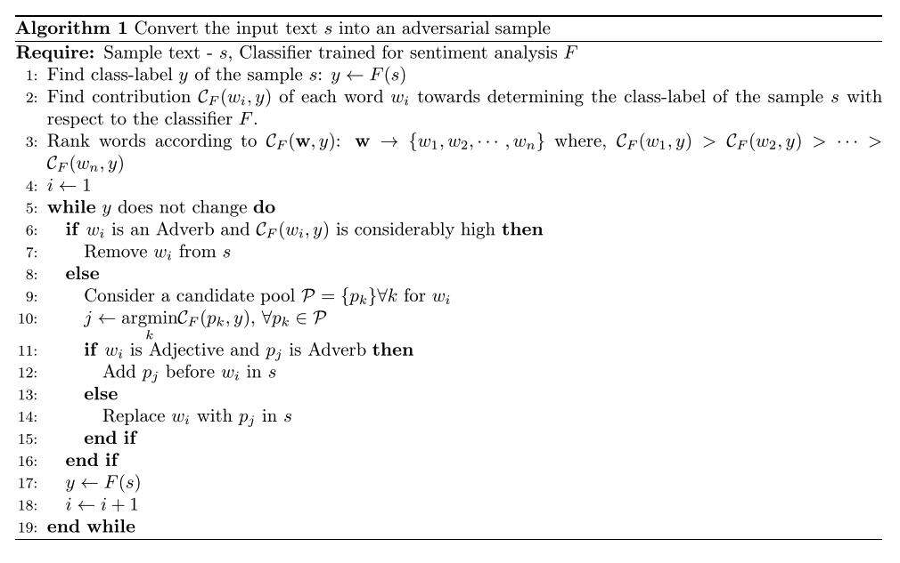

### Title
Toward Crafting Text Adversarial Samples

### Authors
Suranjana Samanta, Sameep Mehta

### link
[Download link](https://arxiv.org/pdf/1707.02812.pdf)

### Contents
1. Introduction
    - SaaS같은 서비스에 adversarial attack이 들어오면 전체적인 모형이 망가져서 서비스 질이 낮아질 수 있음
    - 미리 이러한 데이터에 대해 학습을 해두는 것이 도움이 됨
    - 대부분의 adversarial sample 만들어내는 연구는 이미지에 국한되어 있었음
    - minor change to human eyes but meaningful to classifier
    - 그러나 텍스트 데이터는 이런게 쉽지가 않음
    - 벡터 데이터를 변형하는 것이 어떤 결과가 될지 도저히 짐작조차 되지가 않기 때문
    - 또한 사람이 봤을 때에 이상하다는 느낌이 없어야 되는데 이러려면 문법적 구조를 많이 건드리면 안됨
    - 여기서 활용한 데이터는 imdb 자료
    - 특정 장르에만 의미를 가지는 단어들 존재 -> hilarious같은 단어는 장르에 따라 의미가 다름
    - 혹은 extremely같이 중립 문장에 더해졌을 때에 부정적 / 긍정적 뜻을 강화하는 단어 집어넣기

1. Proposed Method
    
    - 단어를 classification에 중요한 순서대로 나열해놓고
        1. 부사고 중요한 단어면 지우기
        2. 단어 뜻 개떡같게 만드는 candidate pool 만들기
        3. 단어가 형용사고 pool에서 뽑힌게 부사면 부사를 앞에다 넣어주기
        4. 아니면 단어를 pool애서 뽑힌 형용사로 바꿔치우기
        5. 이 과정을 분류가 변하지 않는 수준까지 계속
    - 어떻게 classification contribution 계산?
        - oob error 같이 빼서 확률이 가장 많이 변하는 순서대로
    - 어떻게 candidate pool 만들어냄?
        - synonyms and typos
        = genre specific keywords
    - 결국 여기서 한건 단어 바꿔치우기 / 빼기 / 더하기
    - 단어 수준에서만 변형
    - 현실의 adversarial sample이 과연 이러한 형태일지?

1. 비교
    - textfool이라는 것과 비교해서 testset에 adversarial sample섞어보기
    - textfool보다 자기들게 훨씬 accuracy 많이 떨어짐
    - 나는 개인적으로 왜 rnn과의 비교를 안했는지 모르겠음. rnn이 진짜 adversarial data에 취약할 수밖에 없는 구조인데