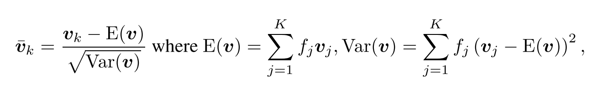
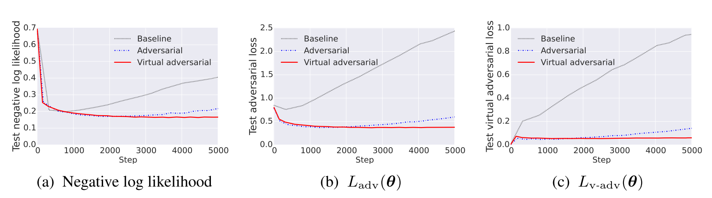
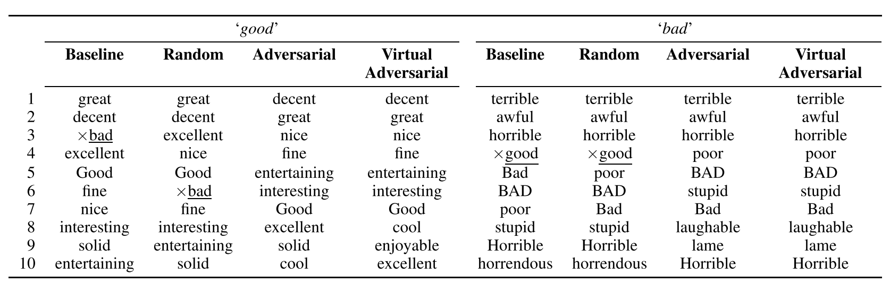

### Title
Adversarial Training Methods for Semi-Supervised Text Classification

### Authors
Takeru Miyato, Andrew M Dai, Ian Goodfellow

### link
[Download link](https://arxiv.org/pdf/1605.07725.pdf)

### Contents
1. Introduction
    - word embedding에다가 perturbation주기
    - 이거는 adversary가 word로 공격하는 경우는 아니고 단지 model regularization/stabilization 측면에서 이해해야 할 것 같음
    - 왜냐하면 perturbed word embedding에 해당하는 word는 실제로 존재하지 않고 attacker는 공격할 때에 이상한 문서(이상한 단어, 오타 등등)을 가지고 공격할 것이기 때문

1. Model
    - a sequence of T words w_1, ..., w_t
    - word embedding + LSTM classifier
    - adversarial training
        - perturbation을 엄청 크게 만드는 것만으로도 classifier를 ㅇ상하게 만드는 trivial solution 존재
        - 이를 방지하기 위해 perturbation은 bounded norm으로 설정
        - embedding을 정규화하여 사용
        
        - f는 i번째 단어의 frequency

1. Adversarial And Virtual Adversarial Training
    - Adversarial Training
        - worst case perturbation의 경우를 만들고 이것도 잘 맞출 수 있도록
        - 구체적으로 −log p(y | x+r_adv; θ)를 cost function에 추가 -> perturbation이 들어갔을 때에 확률이 작으면 cost는 그만큼 늘어나는 구조로 되어 있음
        - radv = −$epsilon$g/||g||2 where g = ∇x log p(y | x; θ). 즉, 확률에 영향력이 큰 변수들을 많이 조지는 방식으로
    - Virtual Adversarial Training
        - 이건 cost에다가 KL-distance를 추가함
        - unsupervised 상황에서도 쓸 수 있다는 장점
        - KL[p(· | x; θ)||p(· | x+r_(v-adv); θ)] -> 만일에 perturbation이 조금 들어갔다고 해서 확률 분포가 확 달라진다면 KL distance가 커질거고 cost가 증가하게 됨
        - Miyato et al. (2016) 여기에서 위의 식을 근사하여 backpropagation시에 학습할 수 있는 방법을 제안했음
    - 여기서 이 사람들은 D*T길이의 concatenated word embedding vector를 loss에 대해 미분해가지고 perturbation 만들었음

1. Experimental Settings
    - 5개의 dataset에 대해 실험해봄
    - Bengio et al., 2006;Mikolov et al., 2010의 weight를 사용해서 weight initialization
    - pretraining 끝내고 마지막 layer와 y 사이에 layer 하나 더 추가해서 training
    
    - testset의 negative loglikelihood를 보면 baseline은 overfit때문에 확 튀는 모습을 볼 수 있음
    - adversarial도 labeled data애 대해서만 학습하기 때문에 끝부분에서는 overfit 경향 조금 보이고 제일 안정적인건 virtual adversarial
    - test error가 5.91%로 state-of-art model과 비슷
    - 이 효과는 random noise 섞은거랑은 확실히 차이가 남/ gaussian random noise 섞었을 때에는 baseline model과 큰 차이가 없음
    
    - 저자들도 x__bad__, x__good__ 이거의 변화에 초점을 맞췄는데 not bad 이런건 수식어에 따라 쉽게 의미가 변할 수도 있고 애초에 강한 긍정, 강한 부정을 나타내는 표현 자체도 아님, 그래서 adversarial training 후에 embedding knn에서 뒤로 밀림

