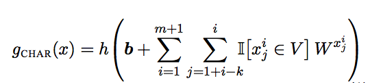

### Title
CHARAGRAM: Embedding Words and Sentencss via Character n-grams

### Authors
John Wieting, Mohit Bansal, Kevin Gimpel, Karen Livescu

### link
[Download link](https://arxiv.org/pdf/1607.02789.pdf)

### Contents
1. Introduction
    - 기존에 character level을 이용해서 embedding하는 방향의 연구가 많이 진행되었음
    - 여기서는 character n-gram을 차원축소해서 character embedding을 흉내내는 방식으로
    - 이 방법이 그럴싸해 보이는게 일단 character-level cnn 이용하려면 kernel 여러 종류를 만들어야 하는데 그럴 필요가 없음
    - 하나의 embedding matrix만 있으면 되니까 그 부분에서 효과적일 수 있음
    - 단 n-gram이 많아지면 차원이 exponential하게 늘어나니까 이 부분은 단점이라고 할 수 있을 것 같음 -> 3-gram 만 해도 원래 자료가 28**3차원임, 이러면 차라리 원래 모형 사용하는게 나을지도 모름

1. Model
    - 
    - character n-gram vector W는 d차원 벡터
    - 저 W 벡터는 어떻게 구하는거지? each unique n-gram마다 저 값이 있어야 하는데...
    - V(the size of character n-gram set)이 커지면 파라미터 수가 엄청 많아질텐데 제대로 되는건지 모르겠구만

1. Results
    - CHARAGRAM 결과물은 |V| = 173,881일 때 제일 좋았음, vocab size가 커질 수록 좋아지는 경향
    - 4-gram까지 사용했었음
    - 한글은 character끼리 모여서 더 큰 단위의 문자를 만드는데 n-gram 수가 더 커져야 하지는 않을지 걱정됨, 아니면 아예 alphabet까지 안나누는 것도 방법이 될 수도 있을 것 같음, 한 글자씩 n-gram 만들기 -> 이렇게 할 경우 오타에 강건한 성격은 많이 줄어들지 싶은데... 해봐야 알 것 같음
    - 여튼 직접적으로 대놓고 특정 character n-gram을 찾는다는 점에서 학습만 잘된다고 하면 결과물은 좋을 가능성 높음
