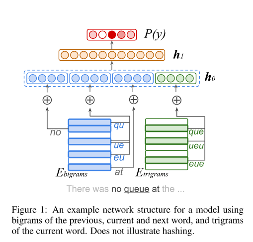

### Title
Natural Language Processing with Small Feed-Forward Networks

### Authors
구글팀

### link
[Download link](https://arxiv.org/pdf/1708.00214.pdf)

### Contents
1. Introduction
    - 무지 많은 수의 파라미터를 사용하는 큰 규모의 rnn structure가 많은 과제에서 사용되고 있음
    - 이런 모형은 computational power가 떨어지는 모바일 기기에서는 못써먹음
    - character-based representation을 사용한 작은 규묘의 fnn으로 조은 결과를 얻어보자는게 이 논문의 목표
    
1. Small Feed-Forward Network Models
    - Model Structure
    
    - 각 단어를 -> group(overlapping bigrams, trigrams)으로 쪼개기
    - 각 group에 들어있는 partition을 embedding matrix를 이용해서 변환 후 group끼리는 1-d concatenation
    - 이걸 변수로 사용해서 2-layer fnn으로 y값 예측
    
    - hashed character n-grams
        - word embedding이 잘 작동하려면 엄청 큰 단어 사전을 커버해야 함
        - character-based embedding이 요새 흥하니 그걸로 해보자
        - v = H(x) mod V_g, where H is a well-bahabed hash function
        - 원래 zero-one encoding -> embedding이라서 embedding matrix가 엄청 커지는 경향이 있었음
        - 여기서는 zero-one encoding -> hashing -> embedding 이건 hash된 값의 size를 조절할 수 있으니 훨씬 작은 matrix가 됨

1. Experiments
    - 평가에는 전통적 metric말고도 computational cost, model size를 고려함
    - language identification에서는 each embedding groups([1,4])마다 평균내서 concatenation해서 feature로 사용
    - 결과물이 썩 나쁘지 않음
    - pos tagging에서는 아마 fig.1에서와 같은 식으로 각 단어마다 pos 예측하는 모형 만들었겠지

1. 느낀점
    - character level embedding하고 이런 모형하고 어떤게 더 오타에 강건한 모습을 보일까?
    - 오타가 있을 경우에 bigram, trigram의 경우 빈도가 굉장히 낮을 것이기 때문에 아마 학습이 잘안되었을 가능성이 있음
    - 그에 비해 cnn은 feature extraction을 하니까 좀 더 괜찮은 모습을 보여주지 않을까?
    