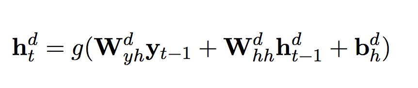
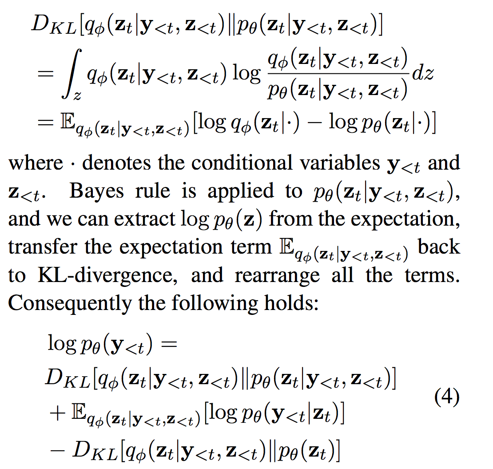

### Title
Deep Recurrent Generative Decoder for Abstractive Text Summarization

### link
[Download link](https://arxiv.org/pdf/1708.00625.pdf)

### Contents
1. Introduction
    - extractive summarization이 아닌 abstractive text summarization은 본문에 있는 글을 그대로 가져다 쓰는게 아니고 완전히 새로운 문장을 만들어서 요약하는 기법
    - 문서 전체 뜻을 이해하는건 물론이고 문장 만들어낼 수 있는 능력 또한 필요
    - 이 방법이 더 현실적: 사람들의 요약은 주로 abstractive하기 때문
    - 주로 사람들은 누가, 무엇을 했는지에 초점을 두어서 새로운 요약문 구성: "who action what"
    - summarization에 저런 sentence structure를 넣은 모형은 드뭄
    - 본 연구에서는 이런 문장 구조를 반영하기 위해서 VAEs를 generative framework로 사용한 seq2seq 모형 만들었음
    
1. Related Works
    - sentence fusion: Barzilay and McKeown(2005), 이건 약간 우라까이같은 느낌일 것 같은데
    - Bing et al.(2015): selecting and merging salient phrases
    - Rush et al.(2015): seq2seq model with local attention modeling
    - Gu et al.(2016): copying mechanism을 seq2seq에 결합시켰다는데.., 간단하게 살펴본 바로는 copynet은 decoding 단계에서 prediction prob만 고려하는게 아니고 copy mode(이건 unique word set에서만 이루어지는 decoding)의 확률을 고려해서 decoding하는 방법. proper noun같은 경우에 이어지는 단어를 그대로 복제할 수 있도록 전체 단어가 아닌 적은 수의 단어에서 target word 나올 확률 높게 잡아서 보정해주는 효과가 있는 듯
    - Miao and Blunsom(2016): 이건 따로 읽어보기
    
1. Framework Description
    - encoder-decoder 부분은 특별한 건 없고 VAEs 부분만 좀 자세히 보면 될 듯
    - 
    - decoding 단계에서 이 부분이 deterministic하게 이루어진다는건데 이걸 바꾸고 싶다는게 논문의 목표
    - VAEs
        - vae input은 y_t
        - variational encoder에서 이걸 z로 encoding
        - pθ(z_t|y_<t, z_<t)가 분포인데.. markov 가정같은게 필요하지 않나?
        - word y_t is drawn from a conditional probability distribution pθ(yt|zt)
        - intractable problem 해결위해서 이용한 근사분포 q 만들고 두 분포가 유사하도록 만들기 위해 KL divergence 구해보면
        - 
        - variational decoder 부분은 특별한게 없는데 encoder 부분이 좀 아리까리함. 아마도 rnn 구조로 variational encoder를 만들면 될듯?
        - 그 다음부터는 ELBO 구해서 학습하는게 다임
    - 역시 variational mean, sd 구할 때에는 zt-1만 사용했음. y_t-1, h_t-1을 변수로 한 MLP 구조임 -> 왜 rnn을 쓰지 않은 것일까? 꼭 모든 데이터를 다 쓰는 것처럼 적어놓고서는
    - 최종 단어 에측에는 variational encoder에서 나온 값과 attention mechanism 거쳐서 나온 deterministic decoder의 히든값을 사용
1. Experimental Setup
    - Dataset은 gigawords, duc-2004, lcsts 사용
    - evaluation metrics에는 rouge 사용했는데 난 아직도 rouge가 좋은 metric인지 모르겠음
    - 결과는 뭐 자기들 모형이 좋았다는 건데.. 엄청 특별한 점은 안느껴짐
    - 논문의 참고할 점이라면 deterministic rnn cell output과 vae의 값을 둘 다 활용한 모형이라는 점인데 사실 vae가 왜 잘 작동했는지 이유도 잘모르겠음
    - 다른 구조의 summarization 모형들도 좀 더 공부해봐야 할 것 같다