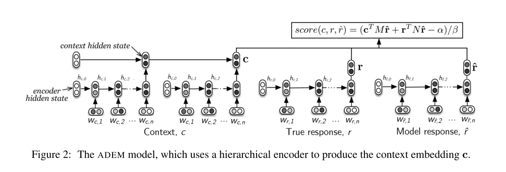

### Title
Toward an Automatic Turing Test: Learning to Evaluate Dialogue Responses

### Authors
Ryan Lowe, Michael Noseworthy, Iulian V. Serban, Nicolas A.-Gontier, Yoshua Bengio, Joelle Pineau

### link
[Download link](http://arxiv.org/abs/1708.07149)

### Contents
1. Introduction
    - non-task-oriented dialog system 만드는게 ai의 궁극적 목표 중 하나임
    - end-to-end neural network 기반 챗봇 나오고 있음
    - 중요한 문제 중 하나는 어떻게 이 모형의 퍼포먼스를 평가할 것인가임
    - turing test? 사람을 직접 써서 하는건 불가능에 가까움
    - 많이 쓰이고 있었던 지표는 BLEU나 ROUGE같은 번역/요약 시스템에 많이 쓰이고 있던 metric
    - word overlap을 기반으로 계산이 들어감
    - 근데 사실 번역과는 달리 응답의 적절함은 단순하게 단어 겹침으로 판단하기는 어려움
    - 이 연구에서 한 짓
        - 사람들에게 응답의 적절성 점수를 받음
        - 이 점수를 예측하는 hierarchical rnn model 만들어 냄
        - 모형이 예측한 값과 사람이 평가한 것 사이의 correlation 구함

1. Data Collection
    - twitter response에 대해서 점수 amazon mechanical turk로 모았음
    - 좋은/안좋은 응답을 고루 모으기 위해 4가지 모형의 dialogue 만들어냄
        - tf-idf based retrieval model
        - dual encoder model(Lowe et al., 2015)
        - hierarchical recurrent encoder-decoder model(Serban et al., 2016a)
        - human-generated responses
        
1. Technical Background
    - 이 부분은 내용이 별거 없네
    - 왜 word-overlap-based metric을 쓰면 안되는지에 대한 설명만 나오는데 사실 당연한 이야기
    - 일반 대화 상황에서 얼마나 다양한 응답이 있을 수 있는지 아는 사람이라면 누구나 다 그렇게 생각할걸?
    - 꼭 Reference대로 이야기 안해도 말만 통하면 되는게 대화니까..
    
1. An Automatic Dialogue Evaluation Model
    - 
    - 일단 3개의 벡터가 있음
        - c(context vector): (아마도?) 그 전 대화 문장들을 받아서 문장별로 encoding -> 문장 벡터를 결합하는 상위 rnn에서 나온 이 전 대화 맥락을 말해주는 벡터인듯
        - r(True response): reference response
        - r_hat(Model response): 이게 수집한 응답인듯
    - 이걸 가지고 스코어 계산
        - 스코어 계산하는 부분은 크게 2파트로 나눠볼 수 있는데 c/r_hat의 weighted inner product 이건 이 전 맥락과 얼마나 coherent한 응답인지 보는거일거고 r/r_hat의 weighted inner product는 reference 응답과의 유사도를 나타내는 부분이라고 볼 수 있겠음
        - 에러는 이 점수와 응답에 대해 사람들이 매긴 점수와의 차이로 계산됨
    - utterance-rnn 구조는 pretraining함(문장 encoding해서 context vector만드는 부분)

1. Experiments
    - 몇 가지 테크닉들 사용한거 정리함
        - vocab size 줄이는데 byte pair encoding 사용
        - layer normalization 사용(hierarchical rnn에서)
        - word length로 bin 만들고 oversampling 적용 -> 왜냐하면 사람들이 긴 문장에 점수 많이 주는 경향이 있어서 짧으면서도 점수높은 문장/길면서 병신같은 문장을 뽑아서 밸런스 맞추려고
    - Results
        - 다른 overlap metric보다 correlation값이 훨씬 높게 나옴
        - 응답 4종류의 averaged rank도 사람이 준 것과 adem으로 만들어낸 값이 거의 유사함
        - qualitative evaluation에서도 사람 점수와 비슷비슷...

1. 느낀점
    - 이전에 강화학습 통한 챗봇 학습에서도 느꼈던 점인데 이 그룹은 어떻게 응답 질 자동으로 평가해서 전체 학습 과정을 자동화할지에 대한 관심이 진짜 높은 것 같음
        - 내 기억으로는 몇 가지 패턴이 있었던 것 같은데.. 응답에서 질문을 만들어내는 확률, ...해서 3갠가 4갠가...로 보상 주는 시스템이었음
    - gan같은거 써서 사람이 응답한 것과 비슷하게 응답을 만드는 방법에 비하면 이런 식으로 reward를 줘서 모형 학습시키게 하는 편이 더 좋지 않을까 싶기도 함
    - 어떤 응답이 좋은 응답인가에 대한 연구가 계속 이루어지면 좋을 것 같네
