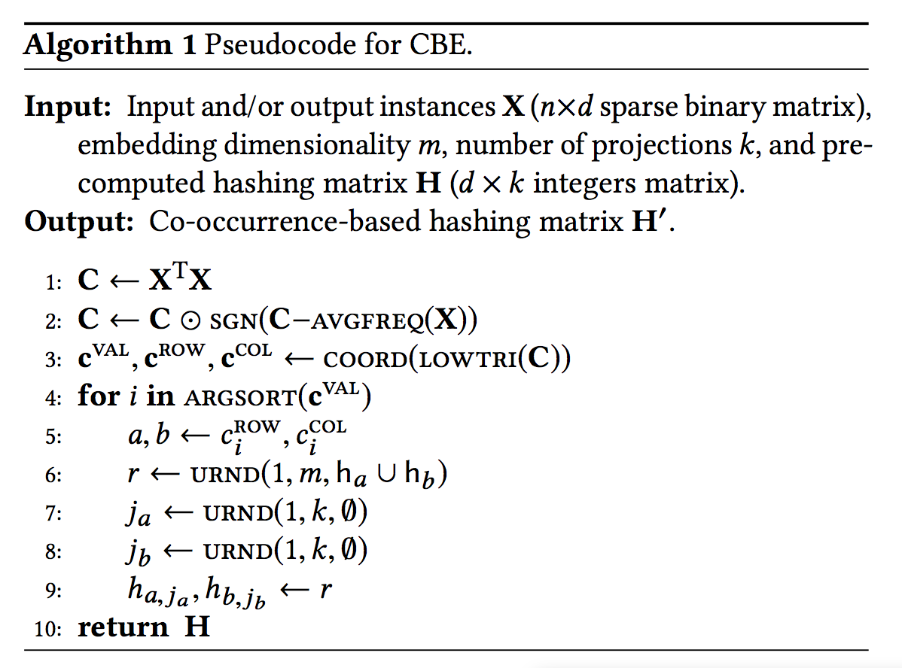

### Title
Getting Deep Recommenders Fit: Bloom Embedding for Sparse Binary Input/Output Networks

### Authors
Joan Serra and Alexandros Karatzoglou

### link
[Download link]()

### Contents
1. Introduction
    - 제목에서 느껴지는 진한 bloom filter의 향기는 무엇..?!ㅋㅋ
    - 추천시스템 문제는 input이고 output이고 차원이 너무 크다는거.. 몇백만개는 우습게 넘어감
    - 차원축소가 방법이긴 한데 embedding matrix parameter가 너무 많은 것도 애초에 문제임. 거의 대부분의 모형 파라미터가 차원 축소에 필요한 것
    - 저게 커서야 모바일 환경이나 이런데에서 잘 돌아가기가 힘듦
    - unsupervised embedding technique that fulfills all the requirements
        - 파라미터 수 적어야 함
        - 모형 코어 구조는 바뀌면 안됨
        - 학습/변환이 빨라야 함
        - reversible해야함 -> 상품 추천을 해야 하니까 embedding된 값만으로는 의미가 없음
        
1. Related Work
    - 보통은 hashing trick같은걸 많이 썼음, 근데 이건 irreversible하니까 output에는 적용을 못함
    - Bloom based error-correcting output codes(ECOC) framework도 있었음
        - ECOC는 multiclass/multilabel classification에 사용되는 건데 각 class마다 codeword를 정해두고 predictor i는 i-th index of codeword를 예측하도록 만듦
        - 만일 codeword의 길이가 15면 15개의 classifier가 있고 각 codeword의 index값을 예측하는거임. 그래서 나온 결과값이랑 원래 부여된 codeword랑 similarity 구해서 그거 기반으로 값 예측
    - class수가 적으면 이게 뭐하는 삽질인가 싶겠지만 class수가 많으면 codeword길이를 그것보다 짧게 만들어서 이득을 볼 수 있음
    - 일단 요정도 정리하고 논문에서 쓴거 한 번 보도록 하겠음
    
1. Bloom Embedding
    - Bloom Filters
        - 블룸필터는 그 자료구조 블룸필터 맞음
        - k개 hash function 사용해서 해당 index값을 1로 변환, m차원으로 projection
        - k가 적으면 false positive 확률이 올라감
        - 저장된 결과값은 binary output이니까 자료 형태랑 무지 닮긴 했는데 hash function은 역함수가 없는데 어떻게 되돌리는걸까?
    - Embedding and Recovery
        - 임베딩 -> sparse matrix에서 1인 값 index뽑고 그걸 hash function에다가 넣어서 나온 값에 해당하는 index를 1로 변환. 이건 걍 bloom filter랑 동일함
        - recovery는 어떻게?
            - 일단 어떤 모형에다가 집어넣었으면 probability vector v_hat이 있을거임
            - 또한 y를 bloom embedding한 ground truth v 벡터도 있을거
            - 일단 y에서 1인 것 인덱스를 모아서 q라고 하자.
            - 만일 원래 q_i를 hash function에다가 넣어서 0이 나왔다 -> 이건 무조건 없는거임(블룸필터 성질)
            - 결국 q_i의 likelihood는 k개의 hash function 넣고 나온 index -> v_hat의 그 인덱스 원소값 전부 곱한 값이 되겠지(v_hat은 확률값이라는거 잊지 말고)
            - 이게 확률이 나오면 이제 복원은 간단한 문제일 것 같은게 sampling method쓰면 됨. 1~d(|y|)까지 hash에다가 넣고 확률 구해서(d*k번 계산 필요하겠네)
            - binomial distribution에다가 넣고 1,0으로 바뀐 벡터 얻으면 됨

1. Experimental Setup
    - General Consideration
        - 데이터는 거의 대부분 sparse함, # of nonzero items / total # of items = 평균적으로 10^-5정도
        - 자료는 총 7가지 썼고 뭐.. 특별한건 없음
        
1. Results
    - 줄인 차원이 실제 차원과 비슷할 때에 결과값이 좋아짐. 근데 다행히 linear하게 성능이 좋아지는건 아님. 꽤나 줄어든 차원에서 성능 거의 100% 복구됨
    - 특정 과제에서는 embedding한게 결과가 더 좋아지는 경우도 있음
    - k(hash function수)는 많다고 좋은건 아님. 1개만 넘으면 2~10까지는 비교적 성능 비슷비슷
    - 2~4 사이에서 고르는게 좋을 듯
    - 학습 시간은 d(embedding dim size)에 따라 linear하게 증가. 
    
1. CBE
    - hash function 적은거 계속 사용하다보면 collision 위험 있음
    - cooccurence 정보를 이용한 hash matrix 만들기
    - 
    - 확실히 납득은 안가지만 자주 일어나는 item을 embedding 차원에서 동시에 값을 키워주는 효과가 있겠지
    - 하나하나 옮기는 것보다 어떤 식으로 옮길지, 얼마나 큰 값으로 변환할지를 cooccurence 기반으로 미리 만들어 뒀으니 정보는 더 풍부해질듯
    - 결과는 그냥 BE보다 전체적으로 나아짐, 대신 차원을 좀 더 작게 만들어도 결과가 좀 더 나았음

1. 느낀점
    - 추천시스템에서 차원을 대폭 줄이는거는 확실히 연구 가치가 있음
    - 특히 아웃풋에서도 축소를 했는데 결과가 잘나온다는게 고무적임
    - 이 임베딩 빙식은 텍스트 분석에서도 괜찮을 것 같은데 특히 CBE를 했을 때에 n-gram feature가 잘 유지될 수도 있지 않을까?