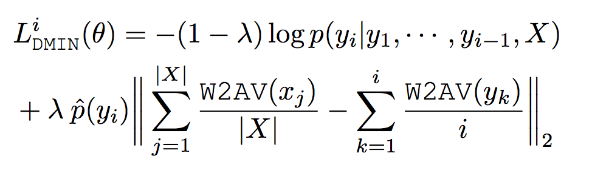
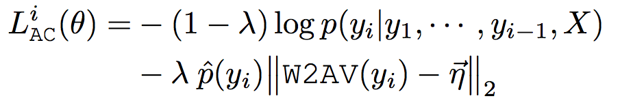

### Title
Affective Neural Response Generation

### Authors
Nabiha Asghar, Pascal Poupart, Jesse Hoey, Xin Jiang, Lili Mou

### link
[Download link](https://arxiv.org/pdf/1709.03968.pdf)

### Contents
1. Introduction
    - neural conversational model 많이 나오고 있는데 생성되는 응답들 보면 짧고, 문맥에서 벗어나고, 멍청하고 따분한 응답이 많음
        - 다양한 해결 시도들이 있음, diverse promoting loss funtion, latent variable model, diverse decoding, adversarial learning, ...
    - 자기들이 보기에 큰 문제 중 하나는 언어의 affection을 포착을 안한다는거..(근데 감정분석도 0, 1로 하는 놈들인데 이런거에 대한 의식은 있을지 모르겠네)
    - 글쓴이의 감정상태가 글의 분위기, 단어 사용 등에 영향을 많이 줌
    - 기존의 모형들은 너무 semantic에만 초점을 둔 건 아닐까?
    - 자기들이 해본 것
        - 단어를 3d-affective에 표상함. 그래서 각 단어별 감정을 부여
        - cross-entropy with affective objective, l2 penalty같이 감정가 많이 벗어나면 페널티주는 방식 썼으려나?
        - decoder beam search에 affective diversity를 넣는 것을 만들었음(확률을 감정가를 이용해서 어떻게 보정하는 방식을 쓴건가?)

1. Related Work
    - Affect Language Model: affective feature포착을 위해 LIWC 사용했음, 그래서 input sentence가 긍정가인지 부정가인지에도 단어 생성 확률에 영향을 줌
        - p(y_i | X, y_1, ... y_i-1, emotion) 이렇게 된다는 말이겠네
    - Emotional Chatting Machine: input에 output에 표현하고픈 감정가를 받음. 8개 감정 사용했다는거 보면 좀 더 정서심리 이론을 고려한 것 같은 느낌. 그리고 internal state나타내는 값이 있어서 얼마나 감정표현을 했는지 내부적으로 표상함. 엄청 재밌는 아이디어긴 한데 input에서 감정가를 추론해서 어떤 식으로 반응해야하는지 모델링했으면 더 좋았을 것 같다. 아마 그렇게 만들기에 자료가 없었을 것 같긴 하지만
    
1. The proposed Affective Approaches
    - Affective Word Embeddings
        - PAD emotional state model 사용했네. 여기서는 VAD라고 했는데 P(pleasure)는 V(valence)와 같은거(물론 이름이, 다른 맥락에서는 다르게 쓰임)
            - valence는 얼마나 happy-unhappy한지
            - arousal은 얼마나 감정적으로 격양된 상태인지
            - dominance는 얼마나 내가 지배적인 감정인지(anger), 약간 공격성을 나타내는 거라고 봐도 무방할 듯
        - embedding을 직접 만든건 아니고 이런 사전이 있었군(Warriner, Kuperman, andBrysbaert 2013)
        - 이 사전에 없는 단어는 neutral state를 나타내는 벡터로 affection 표현
    - Affective Loss Function
        - minimizing affective dissonance
            - source sentence와 generated sentence 사이의 감정가 차이를 최소화하는 방식
            - 
        - maximizing affective dissonance
            - 이건 걍 위에거랑 loss term 부호만 반대임
        - maximizing affective content
            - 각 단어가 무조건 감정가가 풍부한 단어가 되도록
            - 중립 state와 차이가 커야 함
            - 
    - Affectively Diverse Decoding
        - affective diverse beam search
            - 다음 토큰 선택할 때에 확률 보정 term이 들어감
            - 우선 beam을 서로다른 |G|개의 group으로 나누고 이 그룹끼리는 서로 많이 달라야 함
            - 특정 그룹 g에 속한 하나의 beam b에서 새로운 단어 y를 t시점에 추가하려고 하면 확률값에다가 값을 보정해주는데 다른 그룹에 속한 다른 beam들에서 t 시점에 골라진 단어들의 감정가와 많이 달라야 한다는 점
            - 달라야 한다는건 감정가 vector의 cosine similarity가 차이가 커야한다는걸로..
            - 물론 단어 t시점만 쓰는게 아니라 그전 뽑은 모든 단어들의 감정가 고려할 수도 있고 그게 논문에서는 sentence level diversity라고 나옴

1. Results
    - 여기서는 결과 평가에 사람을 썼군..
    - 5명에게 100개 문장 평가하게 함
        - 평가지표는 문법적 정확성, 자연스러움, 정서적으로 적절한 응답인가?
    - 결과를 보면 감정 embedding을 넣었을 때 자연스러움
    - loss function에 관해서는 결과가 좀 뒤죽박죽인데 maximizing affective content가 자연스러움과 정서적 적절성에서 점수가 높음
    - decoding에서는 문장레벨 감정 디코딩이 정서적 다양성 및 적절함 값이 높음

1. 생각한 점
    - 사실 loss function 만들 때에도 저자들도 느꼈던 것 같지만 input emotion과 output emotion이 일치하거나 달라야 한다는 법칙은 없음.
    - 화났을 때 나도 화낼 수도 있고 오히려 굽히고 갈 수도 있음
    - 그래서 input emotion에 대한 output emotion의 conditional probability를 이용했으면 오히려 더 좋지 않았을까 생각이 듦
    - 약간 선행연구에서 본 2번째 논문과 섞어버리는게 될건데 난 그 편이 더 결과가 좋을거라고 생각함