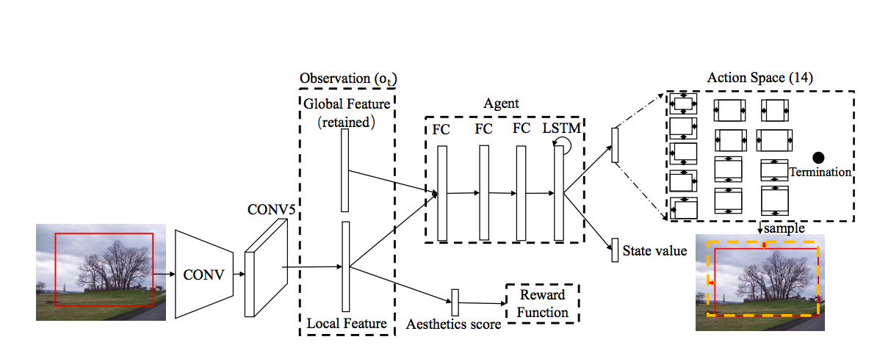
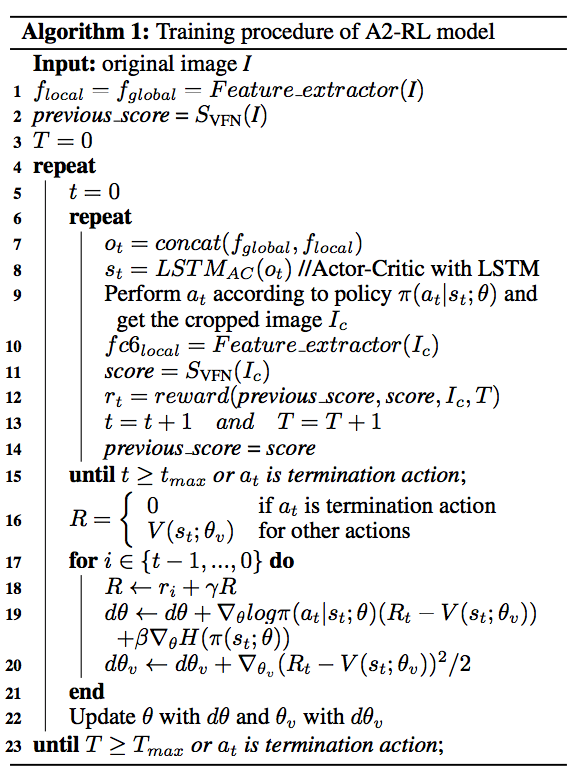

### Title
A2-RL: Aesthetics Aware Reinforcement Learning for Automatic Image Cropping

### Authors
Debang Li, Huikai Wu, Junge Zhang, Kaiqi Huang

### link
[Download link](https://arxiv.org/pdf/1709.04595.pdf)

### Contents
1. Introduction
    - 기존 방식들은 sliding window 만들어서 이미지 훓고 feature들 찾아낸 다음 각 window들 ranking algorithm같은거 적용해서 best window 찾는 방식이 많았음
        - 선행연구들에서 이건 colorfulness / content 등
    - attention-based / aesthetics-based
        - attention-based는 가장 원 이미지의 시각적 특징을 잘 잡아내는 영역 찾는거
        - aesthetics-based는말그대로 aesthetics quality를 측정해서..(어떻게 측정하는걸까?)
    - 정해진 window size때문에 cropping 결과에 한계가 있음
    - 그리고 window가 엄청 많이 필요한데(그림의 여러 영역과 다양한 비율 커버하려면) 이게 엄청 소모적인 작업임
    - 여기서는 cropping을 sequential decision making으로 보고 문제를 풀어보려고 함
    
1. Aesthetics Aware Reinforcement Learning
    - state and action space
        - state는 agent의 observation history(input image, cropping window)
        - image의 local feature랑 global feature는 View Finding Network를 통해서 뽑혀나옴(local feature는 cropped image, global feature는 whole image에서)
        - 14 pre-defined actions
        - 
        - window size를 줄이고 늘리고와 관련된 action들임
        - 각 액션들은 original size를 0.05배씩 줄여나가는 크기로..
    - Aesthetics Aware Reward
        - actor-critic model
        - critic에 해당되는건 VFN
        - reward는 VFN이 준대
        - cropped image의 VFN이 준 점수가 그 전 시점의 점수보다 높으면 positive reward, 낮으면 negative reward
        - 여기서 시간과 ratio의 일정 비율 초과점을 바탕으로 점수 만들어 냄
        
1. 학습 알고리즘
    - 
    - 자료는 AVA라는 aesthetics image database가 있다는군
    - evaluation은 average intersection-over-union하고 average boundary displacement라는 measure 사용

1. 느낀점
    - 강화학슴 공부를 다시 좀 더 해야할 듯
    - 코드가 엄청 간단하네.. VFN은 받아서 써서 그런 것 같긴 한데 너무 간단해서 좀 놀랐음
    - 다움주부터는 강화학습 공부를 좀 더 해봅시당
