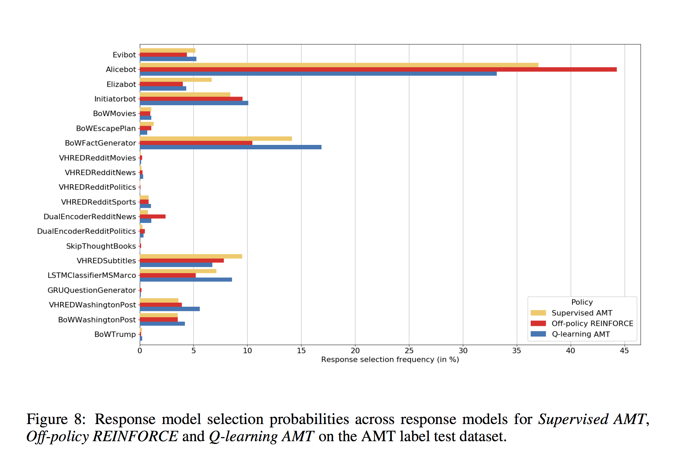

### Title
A Deep Reinforcement Learning Chatbot

### Authors
MIRA팀(너무 많아서 안적음)

### link
[Download link](https://arxiv.org/pdf/1709.02349.pdf)

### Contents
1. Introduction
    - MIRA팀에서 아마존 socialbot competition에 나갔던 챗봇 모형 설명하는 모형
    - ensemble + reinforcement learning

1. System Overview
    - 3단계 시스템으로 구성되어 있음
        - response generation: input으로 dialogue 받아서 output으로 nl sentence 생성해내는 모형. 그리고 각 문장의 internal confidence 나타내는 숫자도 output
        - (1.5, My name is kim) 이런 형태 말하는 듯
        - 여기에다가 음성인식 정확도랑 대화 히스트리 받음
        - 만일 음성인식 정확도가 얼마 이상이고 사람의 말에 대한 정해진 응답(priority response)가 있으면 그걸 대답으로
        - 만일 그게 없다면 generated response 중에서 좋은 응답 뽑아서 그걸로 응답
        - 음성인식 정확도가 떨어지면 다시 말해달라고 부탁

1. Response Model
    - Template based model
        - alicebot: alicebot은 aiml template를 이용해서 미리 응답을 만들어놓은 챗봇임, 
        - elizabot: 두 가지 응답밖에 사실 없음, 공감과 재질문
        - initiatorbot: 40개의 open-ended question 말하는 챗봇. 이건 대화 히스토리에 트리거가 있어야만(ex. hi!와 같은 문장이 전전번에 나와야 함) 문장 생성
        - storybot: 이야기 하나만 해달라는 말에 트리거가 걸려서 재밌는 이야기 말해주는 봇, non-conversational activity이고 특별한 요청에만 반응하는 봇임
        - 여튼 이것들은 정해진 템플릿을 통해서 응답 만들어 냄
        
    - Knowledge base-based QA model
        - evibot: amazon의 qa web service, wh-word(what, who...)있고 entity 있으면 저기에다가 evi.com에다가 보내서 그 응답을 내보냄
        - BoWMovies: 영화제목, 배우, 감독 이름 매치해서 db에 있는 fact 검색한 다음 이를 응답으로 내보내는 챗봇
    
    - Retrieval-based Neural Networks
        - VHRED models: current dialogue history와 비슷한 dialogue history를 dataset에서 찾고 그 히스토리 기반으로 다음에 올 응답 추출, 추출한 응답은 vhred model을 통해서 log-likelihood계산함. 아마 likelihood가 제일 높은 응답을 response로 쓰겠지
        - history dialogue는 glove word embedding으로 유사도 계산
        - vhred model은 reddit의 sport, movie, politic, news 데이터셋으로 각각 학습시킨 4개와 워싱턴포스트, 영화 자막으로 학습시킨 모형 각각 1개씩을 사용
        - SkipThrough Vector Model: SkipThrough vector model로 단어 임베딩하고 민감한 단어와의 유사도 점수가 일정치 이상이면 그냥 아무 대답이나 해버림, 민감한 응답 피하기 위한 용도
        - DualEncoder Model: 이건 VHRED model에서 log-likelihood쓰는 대산 dual encoder에서 나온 bilinear mapping값 쓰는 모형
        
    - Retrieval-based Logistic Regression
        - 대화 히스토리와 무관한 응답 35개 중 하나 선택하는 logistic model에 따라서 응답하는 모형
        
    - Search Engine Based Neural Networks
        - 마지막 대화를 query로 삼아서 웹엔진에서 검색
        - 첫 10개 snippet 가져옴, input query와 이 snippet sentence를 embedding해서 응답으로 적절한지 안한지 예측하는 모형에 변수로 집어넣음
        - 그래서 적절한 snippet만 positive sample로 모아서 응답으로 사용
        
    - Generation-based Neural Networks
        - seq2seq 구조에 how about, how do you think of와 같은 문장으로 시작하는 질문을 decoding단계에서 만들어내는 봇.
        
1. Model Selection Policy
    - state는 dialogue history, action은 response candidate중에서 하나 고르는거
    - maximize discount sum of rewards
    - two approaches
        - action value parameterization: Q(h, a)값을 알아내서 저 q-function값이 가장 큰 action을 선택하는 방법
        - stochastic policy parameterization: stochastic policy를 바로 모델링하는 접근법
        - 저 q-function을 어떻게 만들어낼까?
        - input feature로 1458개 넣었다는데 history의 word embedding, pos, bigram overlap등등 넣음
        - 5-layer neural network, 다섯가지 학습 방식 사용, 4번째 층은 AMT classification layer로 5-dim이고 각각 1~5점을 나타냄
        - AMT layer까지 학습시킬 때에는 질문, 응답 4개 보여주고 각각 1~5점 매기게 해서 이를 기반으로 softmax loss 최소화하도록 학습시킴, 그리고 마지막 layer의 weight는 1,2,3,4,5로 고정(그럼 1~5점까지 점수 만들어낼 수 있음)
        - learned reward model은 그냥 점수 예측하는 linear regression model 만들었음
        - off-policy reinforcement learning에서는 dialogue history 기반으로 REINFORCE 알고리즘 써서 학습, reward가 마지막 1번밖에 없음. reward shaping을 통해서 매 시점의 reward를 임의로 만들어 냄. 감정 분석 통해서 user 응답이 negative이면 reward는 0, positive이면 discounted reward 사용
        - off policy에서 reward를 위에서 만든 learned reward model을 써서 학습하기도 했음

1. 결과
    - 결과 페이지 길지만 난 솔직히 이것만 보면 된다고 생각함
    - 
    - 각 policy에서 선택된 action들을 보면 대체로 차이는 좀 있지만 거의 대부분이 template based model의 응답이고 약간의 retrieval based model이 있는 정도임
    - generative model에서 나온 응답은 선택된게 거의 없음
    - 이래도 뉴럴넷 기반 챗봇입니까?
    - 나도 실제로 aliza써봤었는데 신통방통할 정도로 응답이 자연스러웠음... 그냥 적절히 fact나 검색해서 말해주고 적절히 자연스러운 template만 많이 만들어도 꽤나 만족스러운 챗봇 만들 수 있다는거
    - 아마 fully generative model chatbot이 나오는건 몇 십년은 지나야 할 것 같다..