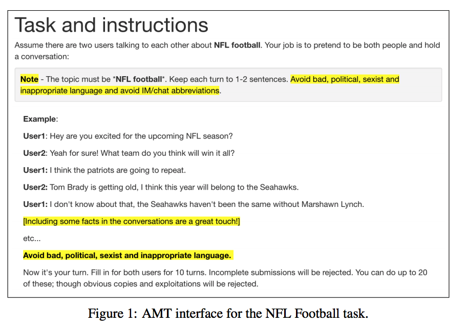

### Title
Edina: Building an Open Domain Socialbot with Self-dialogues

### Authors
Ben Krause, Marco Damonte, Mihai Dobre, Daniel Duma, Joachim Fainberg,
Federico Fancellu, Emmanuel Kahembwe, Jianpeng Cheng, Bonnie Webber

### link
[Download link](https://arxiv.org/pdf/1709.09816.pdf)

### Contents
1. Introduction
    - 아마존 소셜봇 콘테스트에 낸 Edina 챗봇에 관한 논문
    - self-dialogues를 스스로 모았다는게 발전된 점 중 하나라는데 뭔 소린지.. 읽어봐야 알 듯

1. Data Collection
    - fully data-driven model을 만들기 위한 모형 학습을 위한 데이터가 적음
    - 직접 자료를 모았는데 2가지 점이 중요
        - casual human dialogue
        - identifiable topics
    - 
    - 이렇게 AMT를 이용해서 한 사람이 다중이 짓을 하면서 혼자서 대화 만들어가게 시킴
    - 저렇게 24283개의 dialogue를 모았고 4개의 큰 주제에 관한 대화록임
    - 저거 모으는데 18,000달러 썼다는데 엌ㅋㅋㅋ 나죽네.. 저게 돈이 얼마야

1. System Architecture
    - rule-based / data-driven components들의 결합으로 이루어져 있음
    - rule-based component
        - 유저 반응이 정확히 룰에 매치될 때 정해진 템플릿에 따라 대답함
    - maching score
        - 대화 콘텍스트 가지고 대화 생성하고 conficdence score 내보내는 component
    - generative neural network
        - 항상 대답 생성
    - three minor components
        - EVI: wh-question에 대해 fact 응답하는 봇
        - lies and dislikes: opinion 물어볼 때 rule-based로 커버 안되는 것에 대해 대답
        - proactive component: 그 전에 matching score가 괜찮았던 시점으로 돌아가서 이야기하자고 이야기하는 봇
    - 여기서도 각각 컴포넌트들이 얼마나 쓰였는지 봤는데 뉴럴넷 기반이 20%정도밖에 안됨, 아마 이것도 반응이 더 좋은걸로 튜닝했으면 더 떨어지지 않았을까?
    - 생각보다 시스템 구조가 단순하네..
    