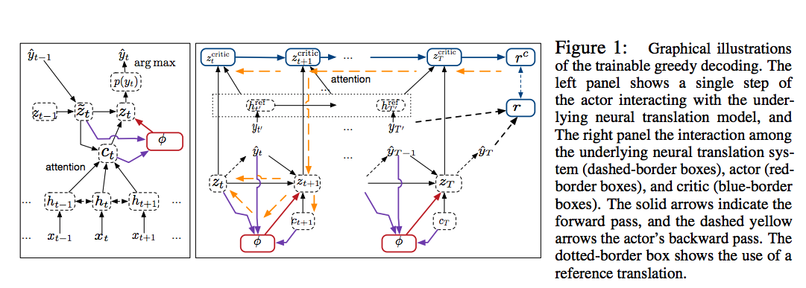

### Title
Trainable Greedy Decoding for Neural Machine Translation

### Authors
Jaitao Gu, Kyunghyun Cho, Victor O.K Li

### link
[Download link](https://arxiv.org/pdf/1702.02429.pdf)

### Contents
1. Introduction
    - NMT 활용이 아주 넓어지고 있음
        - subword도 잘다루고 multi-language도 한 모형으로 다룰 수 있게 발전하고 있음
    - 일반적인 방법은 reference translation의 conditional probability를 maximize하는 방식으로 학습
    - 근데 예측에는 모든 문장에 대한 conditional probability를 학습하는건 불가능이니 decoding에는 greedy algorithm이나 beam search 사용함
    - 많은 연구들이 좋은 모형을 만들고 학습하는데에 신경쓰는데 decoding에는 크게 신경을 안씀
    - 여기에 대해 새로운 방식 제안.. neural network기반 decoding algorithm
    
1. Trainable Greedy Decoding
    1. Many Decoding Objectives
        - decoding objective logp(Y|X) 이게 최적의 decoding objective인가? 그렇지 않을 수 있어라는게 이 논문의 시작
        - log probability와 BLEU score간 correlation이 낮을 수도 있다는 연구들이 있음
        - 그리고 beam search에서 beam size 와장창 늘리면(logp(Y|X)에 더 가까워지겠지) 오히려 번역 질이 구려진다는 연구 또한 있음
    1. Trainable Greedy Decoding
        - noisy, parallel approximate decoding(NPAD) algorithm
        - z_t = f(z_t−1 + epsilon_t, y_t−1, e_t(X; θe); θf)
        
        - decoding 단계에서 latent vector z_t에 의존하기, 그리고 이 z_t를 만들어낼 때 노이즈를 섞어서 번역 질이 떨어지는 것을 막기
        - 새롭게 제안하는 모형은 epsilon을 parametric function을 이용해서 만들어 낸다는거(그림에서의 phi에 해당하겠지)
    1. Learning and Challenges
        - z_t를 만들어내는 agent의 새 파라미터 φ를 update해야하는데..
        - learning objective는 Y~G(X)일 때, 어떤 arbitrary decoding objective R(Y)의 기댓값을 최대화하도록..
        - R에 따라서 학습이 굉장히 어려울 수 있음

1. Deterministic Policy Gradient with Critic-Aware Actor Learning
    1. Deterministic Policy Gradient for Trainable Greedy Decoding
        - critic R^c로 differentiable approximator를 만들고 이를 학습
        - critic이 잘 학습이 되면 z를 만들어 내는 φ는 저 critic을 최대화하도록 학습시키면 됨
    1. Critic-Aware Actor Learning
        - 이 deterministic actor의 대부분의 action(z)들은 zero return임(한마디로 안쓰여야 할 단어들이 되는거)
        - 다행히 pretraining된 모형에 따라서 만들어진 저 값들은 대부분 괜찮은 return값 가지고 있어서 학습이 괜찮게 됨
        - 그래도 더 개선해보기
        - φ학습할 때 gradient의 expectation 사용
        
1. 생각해야 할 점
    - 핵심은 recurrent structure인 critic R^c와 z를 만들어내는 actor network 2개임
    - 이걸 어떻게 잘 학습하는지가 핵심이네
    - critic 학습할 때에 true reward는 어떻게 준거지? 단어가 같으면 1, 아니면 0 이런 식으로 준걸까?
    - 그게 아니고 BLEU score를 썼군... 아 내가 바보다!! ㅋㅋㅋㅋㅋ