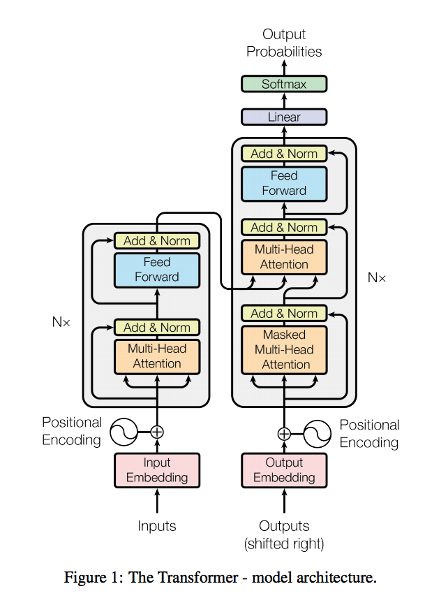
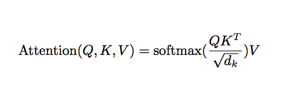

### Title
Attention is all you need

### Authors
Vaswani et al. (2017)

### link
[Download link](https://arxiv.org/pdf/1706.03762.pdf)

### Contents
- Recurrent structure 완전히 배제하고 attention mechanism에만 의존하는 새 구조
- Model Architecture
    - 
    - Self-attention
        - Multi-Head Attention: Scaled Dot-Product Attention을 여러개 이어붙인 모형, 그럼 Scaled Dot Product Attention은 뭐임?
        - 
        - encoder-decoder model에서 Q(query)는 decoder layer의 마지막 값들.. masking을 해서 t 시점에는 t시점 이전 단어만 있는 것처럼 자료를 보이게 만들겠지.. 마치 left triangular matrix처럼?
        - K, V는 encoder에서 나오는 값이라는데... 교과서에 있는 내용을 보면 이 두개가 다른 값은 아니고 걍 같은 encoder의 last layer의 output인 것 같음
        - Q*trans(K)가 input, output사이의 관계를 나타내는 matrix가 되는거고 이 값에 의해 input value의 representational matrix의 weighted sum으로 attention을 구하는거라고 생각하면 되겠네..
        - 이론상으로는 사실 seq2seq구조의 encoder, decoder에서 dot-product attention 이용한 것과 차이가 없는 것 같음
        - 단지 다른 점이라고 한다면 encoding시에 rnn을 이용하여 단어별 representation을 찾았느냐 아니면 input word사이의 relationship을 이용한 self-attention을 이용해서 word vector representation을 찾았느냐.. 이거 생각해보면 cnn구조를 이용하려고 한 것과 본질적으로는 다른게 없음..
        - character level cnn을 이용한 embedding + attention과 비교해서 성능차이 많이 안날지도 모르겠네
    - Why self-attention
        - 딱히 다른 이점을 많이 말하는건 아니고 계산복잡도 이야기하는데 근데 차이가 좀 많이 나긴 함.. 특히 input부분에 관해서 recurrent 구조가 없어서 input length에 관해서 linear complexity가 나온다는 점이 장점이네
- 번역기 구조 encoding부분을 크게 나눈다면 rnn, cnn, self-attention 이렇게 가는 것 같음.. 어떤게 가장 좋은 representation을 찾을 수 있느냐..
- word embedding만 character level cnn으로 바꾸고 self-attention을 적용하는게 가장 좋은 결과 내지는 않을까?