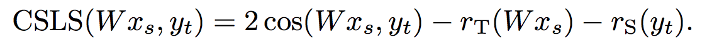

### Title
Word Translation without Parallel Data

### Authors
Alexis Conneau, Guillaume Lample, Marc’Aurelio Ranzato, Ludovic Denoyer, Herve Jegou

### link
[Download link](https://arxiv.org/pdf/1710.04087.pdf)

### Contents
- 자연어 처리에 관한 많은 연구들이 distributed representation of words(word embeddings)를 사용하고 있음
- Mikolov et al(2013b) 연구 결과에서 이런 embedding space가 비슷한 구조를 보인다는 것을 보임, 만일 서로 다른 두 word embedding을 돌리고 늘리고 여튼 선형변환을 해서 비슷하게 맞춰놓으면 비슷한(다른 언어에서 같은 뜻을 의미하는 단어 pair) 단어 쌍이 없더라도 unsupervised learning느낌으로 단어 매칭 / 번역이 가능할 것
- 기존에는 이를(bilingual supervision) 위한 선형 변환을 학습히기 위해 어떻게든 anchor로 사용할 단어 pair를 쓰는 방법을 택했음
- unsupervised supervision을 위한 연구들이 진행되긴 했지만(smith et al., 2017, Zhang et al., 2017등) 결과가 parallel word pair를 사용하는 것에 비해 결과가 좋지 않았음
- 이 연구에서는 이런 단어쌍 없이도 두 embedding space를 맞추는 선형변환 찾기 방법을 연구함
- 크게 3 step으로 나눠볼 수 있을 것 같음
    - adversarial learning
    - Procrustes analysis
    - CSLS
- 각각에 대해 좀 더 알아보자
    1. adversarial learning
        - 두 개의 미리 학습된 embedding이 있다고 하자(source words, target words)
        - source쪽은 고양이:(1,1), 나:(1,-1), target쪽은 chat:(-1,1), Je:(1,1)로 바꾸는 embedding matrix가 있다고 쳐보겠음
        - 만일 discriminator에게 이 두 embedding space를 구분해보라고 하면 꽤나 쉬울거임, 왜냐면 (1,-1)은 한국어, (-1,1)은 불어에만 나오니까
        - 만일 source쪽에 [[-1,0],[0,1]] 이걸 곱한 선형변환을 한다면? 두 분포가 동일하게 생겨서 아마 구분하기가 어려울거임
        - 그리고 Wx는 y에 완벽하게 대응이 됨, W*고양이 -> chat, W*나 -> Je
        - 이런 W(linear transform matrix)를 찾는걸 학습하는게 adversarial learning의 목표
        - 구체적으로는 다음과 같음
        - 
        - discriminator는 각 embedded word들을 input으로 받았을 때에 어떤 쪽에서 왔는지(target, source)를 맞추는 neural network
        - generator는 두 embedding이 비슷하게 보이도록 만드는 linear mapping
        - 학습 단계에서 L_D와 L_W를 최소화하도록 theta와 W를 조정
        
    1. Refinement procedure(procrustes analysis)
        - 여기에 대해서는 closed form이 존재
        - 
        - X,Y matrix는 모든 단어를 다 쓴게 아니고 가장 많이 등장한 단어 몇 개만 쓰고 mutual neighbor일 때에만 쓰도록 pairing
    
    1. Cross-Domain Similarity Local Scaling(CSLS)
        - 그럼 단어 matching은 어떻게 할까?
        - Wx와 가장 similarity가 높은 y를 찾으면 되는거 아님?
        - 연구결과에 따르면 high-dimensional space에서는 특정 *hubs* vector가 많은 neighbor들을 가지고 있는 경우가 많음
        - 이 hubness를 어떻게 하면 완화할 것인가?
        - bi-partite neighborhood graph를 이용했음 이 논문에서는
        - CSLS는 두 파트로 이루어져 있다고 볼 수 있음, 하나는 source, target vector의 유사도를 구하는 부분: 2*cos(Wx, y)
        - 주변에 비슷한 representation를 가진 다른 단어가 졸라 많은 단어를 피하게 하는 penalty 부분: mean similarity of a source word to its target neighbors
        - 
        - 요 식에서 내가 x(고양이) -> y(변역된 어떤 단어)를 찾는다고 해보자
        - 2*cos부분과 r_T(Wx) 부분은 바뀔게 없음
        - 결국 어떤 target y_t에 연결되느냐에 따라 달려있는데.. 이게 만일 source쪽에 비슷한 느낌을 주는 다른 단어가 많다면 similarity가 커져서 CSLS 전체가 작아질 것이고 만일 그렇지 않고 주변 K-nn이 다 좀 별로 상관없는 아이라면 저 값이 작아서 CSLS를 많이 안깎을거임
        - hub는 주변에 비슷한게 왕창 모여있으니 저기서 많이 깎여서 전체적으로 hubness에 페널티를 줄 수가 있게 되는거
        
- 이 논문 읽고 예전에 페북에서 냈던 유사도 빨리 구하는 방법에 대한 논문이 왜 나왔는지.. 다른 연구들이 어떤 맥락에서 이루어지고 있는지에 대해 뭔가 감을 잡을 수 있었음
- 이제 이걸 이용해서 unsupervised sentence translation을 어떻게 하는지 내일 그 논문을 보면 될 것 같네
- adversarial learning을 텍스트 분석에서 이용한 것들은 대체로 구려보였는데 이 논문에서 쓴 방법은 꽤나 일리있어보임, 재밌는 아이디어인 것 같다