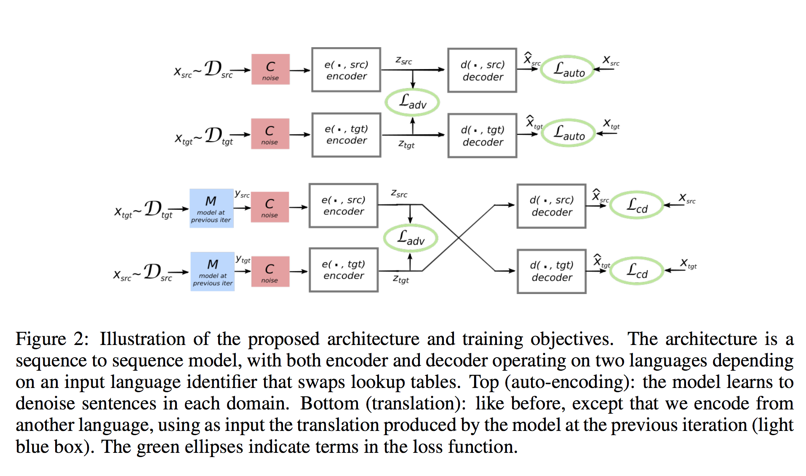
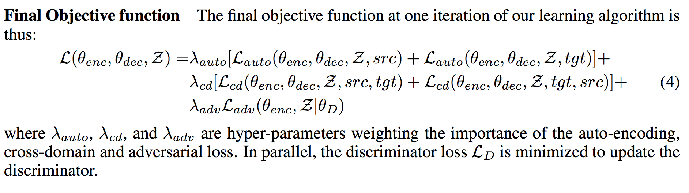

### Title
Unsupervised Machine Translation Using Monolingual Corpora Only

### Authors
Guillaume Lample, Ludovic Denoyer, Marc’Aurelio Ranzato

### link
[Download link](https://arxiv.org/pdf/1711.00043.pdf)

### Contents
- 기본적인 원리는 coarsely translated sentence -> autoencoder 사용해서 좋은 문장으로 재복원이라는 구조
- 첫 어정쩡한 번역은 이전 연구(Conneau et al., 2017)에서 나왔던 word-level translation
- x: source sentence, y: target sentence라고 해보자
- C: noising function, 원래 문장을 이상하게 섞어서 noised sentence로 만드는 함수
- e(x, l): encoder, 문장을 latent space로 projection하는 함수
- d(z, l): decoder, latent space로 projection된 값들을 받아서 원래 문장으로 복원하는 함수
- x, y 각각 개별적인 encoder, decoder가 있다고 생각하면 쉬움(실제로 논문에서는 하나만 사용했지만)
- 원래 문장 복원은 d(e(C(x), source_language), source_language) -> x가 되도록 학습하는거임 (boy i a am) -> (i am a boy)
- 만일 e(C(x), source_language)와 e(M(y), target_language)가 비슷한 값을 가지게 된다면(e('boy i a am', en) ~~ e('나 이다 소년', 'ko')) 저 값을 가지고 noised x처럼 번역되어야 할 문장(y)를 대신 넣었을 때에도 원래 문장 x를 잘 복원할거임
- 그렇게 된다면 결국 y -> x가 되어서 번역이 되는게 아니냐는게 이 논문의 전체적인 구조임
- 논문에 실린 위에서 설명한 구조 
- denoising autoencoder를 source, target이 각각 가지고 있고 이걸 별개로 학습한 다음 번역에서는 섞어서 쓴다는게 좋은 아이디어같음
- traning specification
    - 
    - 위에 적혀있는 loss를 크게 3개로 나눠볼 수 있음
    - 첫 번째는 autoencoder에서 decoder 학습 : line 1
    - 두 번째는 cross-domain 학습(x -> x 복원이 아닌 y -> x 복원) : line 2
    - 세 번째는 cross-domain을 잘하기 위해 encoder에서 projection된 결과값들이 두 언어에서 최대한 비슷하도록 만들기 위한 adversarial learning(여기는 pretraining이 있을 수도 있음, 뭘로? Conneau et al., 2017의 방법을 써서): line 3
    - 논문에서는 특히 cross-domain 학습이 중요하다고 이야기함, 그리고 autoencoder 학습시킬 때에 noise를 줘서 학습시키는게 중요. 단어를 일정 확률로 빼고 순서를 섞는데 순서는 원래 위치에서 3 word-distance 넘게 벗어나지 않도록, 단어 제거 확률은 0.1로 세부조정했었음
    - 결과를 보면 supervised learning 결과에는 못미치지만 충분히 성능 향상은 있었음
    - paired sentence를 못만드는 경우에 꽤나 좋아보임
