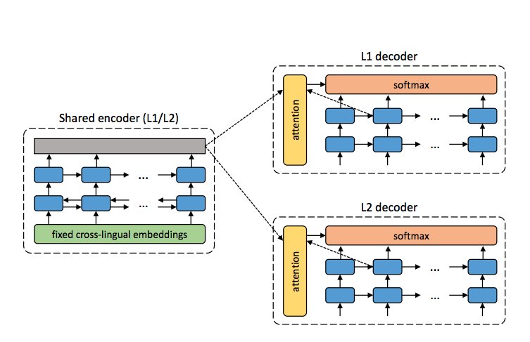

### Title
Unsupervised Neural Machine Translation

### Authors
Mikel Artetxe, Gorka Labaka, Eneko Agirre, Kyunghyun Cho

### link
[Download link](https://arxiv.org/pdf/1710.11041.pdf)

### Contents
- 내용 자체는 얼마전에 봤던 페이스북에서 나온 unsupervised NMT와 거의 똑같음
- 근데 여기 그림이 좀 더 직관적이라서 한 번 가져와봤음
- 
- 공통 monolingual encoder(이 인코더는 두 언어에서 비슷한 문장을 비슷하게 encoding해야하는 성질을 가져야함)를 통해 문장 encoding, 학습때에는 denoising autoencoder처럼 l1 encoder -> l1 decoder / l2 encoder -> l2 decoder로 문장복원, 번역시에는 l1 encoder -> l2 decoder로 문장번역
- 이런 분야를 statistical dechpherment라고 하는가봄.. 좀 더 공부해 볼 필요가 있을 것 같음
- 이전 모형에서 adversarial attack을 통해 encoder의 분포를 최대한 비슷하게 맞추는 데에 초점을 두고 있었다면 여기서는 일종의 pseudo-parallel sentence를 만들어 많이 학습을 시키기 위해 backtranslation 방법을 가져왔음
- 별건 아니고 모형 만들었으면 l1 -> l2로 번역해서 l2에서 l1을 만들 수 있도록 모형을 학습시키는거
- 이 방법은 fb논문에서는 적용 안되었던건데 아마 둘 다 섞으면 성능이 더 향상될지도(그 논문에서 supervised learning의 경우 아주 결과가 좋았던 거 생각해보면..)
- 결과를 보면.. 이전 논문하고 거의 유사한데 꽤나 성능은 나오지만 semi-supervised보다는 꽤 많이 못미치는 결과임..
- semi-supervised learning을 위한 새 데이터를 만들 때에 먼저 초벌번역하는 정도 사용하면 아주 좋지 않을까?