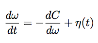
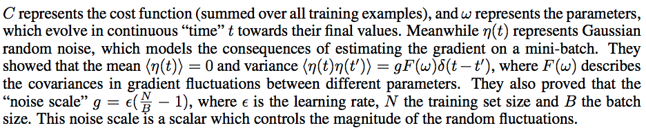

### Title
Don't Decay The Learning Rate, Increase the Batch Size

### Authors
Samuel L. Smith, Pieter-Jan Kindermans, Quoc V. Le

### link
[Download link](https://arxiv.org/pdf/1711.00489.pdf)

### Contents
- Batch size와 learning rate의 decay에 관해 좀 더 자세히 기술하고 실험한 논문
- 딥러닝 학습할 때에는 보통 full batch를 사용하는게 아니고 minibatch를 이용한 SGD를 사용
- SGD가 full batch에 비해 몇 가지 장점을 가지고 있는 면이 있는데
    1. 하드웨어 문제에서 좀 더 자유롭고
    1. full batch에 비해 좀 더 generalization이 잘되더라는 장점이 있음
    1. 이런 generalization power는 작은 batch를 썼을 때에 좀 더 좋다는 보고들이 있음
- 이 논문은 이전 논문(Smith & Le,. 2017)의 noise scale에서 이야기를 좀 더 발전시켜서 딥러닝 학습에서 좀 더 효과적으로 접근할 방법에 대해 이야기하는 거임

- 우선 이전 연구의 결과를 좀 가져오자면.. SGD는 아래와 같은 식의 partial stochastic equation문제를 푸는거라고 관점을 바꿔서 생각해볼 수 있음
- 
- 이 때 저 $eta$는 평균이 0이고 variance가 각 파라미터들의 공분산 matrix * noise scale "g"인 gaussian 분포를 따름
- 저 noise scale은 결국 전체 데이터가 아닌 mini-batch를 사용해서 생기는(그래서 전체 데이터에 대한 loss 최소화 방향을 예측하는 데에 실패한) 오차인데 이게 generalization에 오히려 이익이 된다는 것이 지난 논문에서 했던 이야기였음(물론 실제로는 좀 더 복잡한 이야기를 했음)
- 
- g를 점차 줄여나가면 cost function의 minimum으로 수렴을 하는데.. 결국 내가 저기서 바꿀 수 있는 값은 $epsilon$(learning rate decay)와 B(batch size)임
- 이 논문은 B를 차라리 늘리고.. 늘릴 때 step function의 형태로 늘리라는 이야기를 최종적으로 하고 있음
- 그럼 왜 이렇게 해야하는가?
    - B를 늘리면 좋은 점: B를 늘리면 한 번에 쓰는 자료가 많아져서 같은 만큼의 epoch step만큼 학습해도 전체 parameter update step수는 줄어들게 됨. 그리고 이렇게 했을 경우에도 실제 test set에 대한 prediction accuracy는 거의 낮아지지 않음
    - step function의 형태로 해야하는 이유: simulated annealing에서 temperature를 급격하게 낮추는 방식을 쓰면 minima근처 curvature가 완만한 경향을 보임(다른 곳으로 이동할 transition prob 계산할 때 보조해주는 양이 확 줄어드니까.. 쭉 떨어지는 곳으로 못가는거지 조금은 움직일 수 있어도.. 그러면 조금씩만 움직일 수 있는 곳에서 놀거라는거)
- 이론적인 설명이 많지는 않은 논문이라.. 대충 이 정도 이야기하고 실험 결과를 보면 확실히 batch size를 증가시키는게 적은 parameter update에서도 decaying learning rate방법과 거의 같은 최종 결과를 보임
- 요즘에 전체적으로 batch size를 늘려보려는 시도가 많은 것 같은데 이를 실증적 / 이론적 양쪽 측면에서 꽤나 자세히 이야기하는 좋은 논문이라고 생각이 됨
- 사실 전체적인 학습 과정으로 보자면 layer normalization에서 받았던 느낌처럼 막 획기적인 변화라기보다는 이것도 일종의 테크닉인 것 같음
- 조만간 이 방법이 대세가 될 수도 있지 않을까...