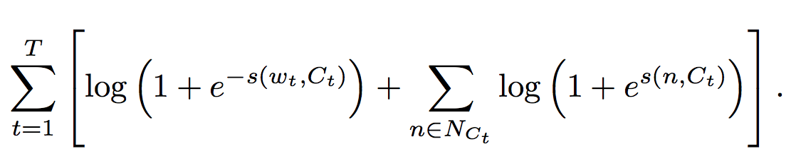
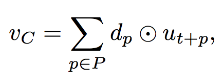

### Title
Advances in Pre-Training Distributed Word Representations

### Authors
Tomas Mikolov, Edouard Grave, Piotr Bojanowski, Christian Puhrsch, Armand Joulin

### link
[Download link](https://arxiv.org/pdf/1712.09405.pdf)

### Contents
1. Introduction
    - word2vec을 통한 pre-trained word representation 많은 연구에서 pipeline으로 사용되고 있음
    - 이게 얼마나 많은 정보를 담고 있는지에 따라 모형의 성능이 차이가 많이 날 수 있음
    - 기존에 cbow model, fasttext, glove등이 있었는데 최신 연구들의 improvements 적용한 좋은 word representation 만들어서 공개하는게 목표

1. Model Description
    - cbow model objective function
        - w: target word, C: context
        - score function s(w, C)
        - softmax function으로 s(w, C)를 쓰려고 하면.. 단어가 많은 경우 score function 구하는게 너무 힘들어짐. 결과도 안좋음
        - 각 단어마다 binary classifiers 생각하고 objective function 개조
        - 
        - 앞의 식은 그 단어 나올 확률을 높이도록 만드는 부분, 뒤에는 negative sample의 확률 낮도록 만드는 부분
        - scoring function은 context에 들어 있는 단어와 target 사이의 mean dot product value
    - 모든 단어 다 동일하게 돌아가면서 하면 많이 나오는 단어에 대해서만 학습이 많이 됨.. sampling 확률 조정
    - position dependent weighting
        - 위의 cbow에서 context와 target의 평균 dot product 쓴다고 했었는데.. 단어 위치 고려한 context vector를 구해서 이거랑 target word랑 유사도 구하는게 나을 수 있음
        - position별로 위치에 따라 값을 변경시켜주는 vector d가 있어서 context값은 아래와 같이 구해짐
        - 
        - 같은 단어라도 위치에 따라 다른 d와 곱해지니까 representation이 좀 다르게 됨
    - 또한 MI값이 높은 word n-gram을 하나로 만들어 하나의 단어처럼 취급함
    - context에 들어가는 단어가 좀 더 풍부한 의미를 담고 있는 단어가 됨
    - 비슷한 형태의 단어는 비슷한 의미를 가지고 있을 가능성 높음
    - 이 정보를 살리기 위해서 word representation에 character n-gram값의 평균을 더해서 최종 word representation으로 만들어버림
    - vetted -> repr(sitted) + hash(vet) + hash(ett) + ... 이런 식으로
    - character n-gram에 대해서는 hash trick써서 각 character n-gram에 unique한 vector를 줬음. 이것도 모형으로 만드려면 너무 비효율성이 커지니 이렇게 했음

1. results
    - 이렇게 만들어진 word vector는 analogy test 및 다른 모형의 pipeline으로 쓰였을 때 기존 모형보다 훨씬 성능이 좋았음
    - 우왘ㅋㅋ 이런건 없는데 가져다 쓰기는 참 좋은 듯

결과보면서 생각난건데 한글 analogy test 데이터는 있나? 좀 찾아봐야 할 것 같음.