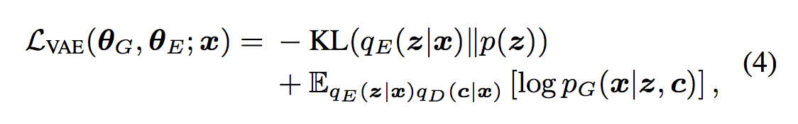
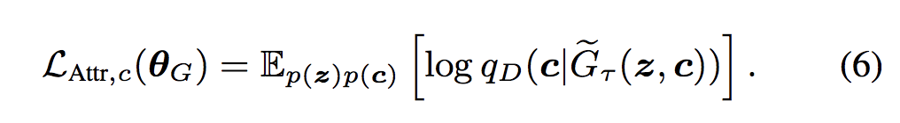
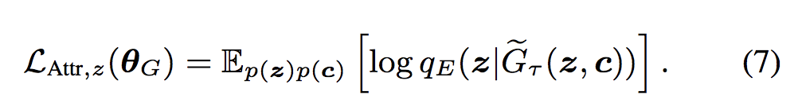

### Title
Toward Controlled Generation of Text

### Authors
Zhiting Hu, Zichao Yang, Xiaodan Liang, Ruslan Salakhutdinov, Eric P. Xing 

### link
[Download link](https://arxiv.org/pdf/1703.00955.pdf)

### Contents
1. Intro
    - 문장의 attribute(긍/부정, 평서/높임, ...)를 통제할 수 있는 문장 생성기 만들기
    - 사실 지금까지의 seq2seq 구조의 generator는 그런 attribute에 대한 통제 없이 단순하게 probability density estimation 한거라서 생성된 문장이 오락가락이었음
    - 어떤 자료를 주로 모아서 training했는가에 따라 성능이 확 차이가 남
    - 그림같은 경우는 style transfer 분야가 엄청나게 많이 개선이 되었는데.. 이는 content와 style을 나눌 수 있는 loss를 잘 정의했었기 때문..
    - text에서는 그런 식으로 잘안됨.. 어떻게 style을 그냥 뽑아낼 수 있을까? pos 정보나 이런걸 좀 더 이용하면 될 것 같기는 한데 쉽지가 않음
    - 이 논문에서는 style을 vae를 통하여 latent variable로 만들고 문장 생성시에 이 값을 조절해서 문장 생성 과정에서 style을 통제할 방법을 궁리함

1. Model Structure
    - 문장 x를 encoder를 통해 latent variable z로 나타냄과 동시에 structured latent variable c를 통해서 문장 attribute를 control
    - 원하는 대로 잘 된다면 z에는 semantic information이, c에는 attribute information이 잘 담겨서 학습이 되겠지
    - 문장이 어떻게 원하는 attribute를 가지고 생성이 잘 되었는지를 판단해서 parameter update를 할까?
    - 원하는 attribute를 가졌는지 판단하는 discriminator가 있어서 supervised learning을 통해서 c를 update
    - latent variable z는 일반적인 gaussian prior 사용, c는 속성에 따라 다양한 prior 사용(예를 들어 긍부정 따지는 문제라면 beta distribution같은거 사용할 수도 있겠지)
    - 
    - 위에 식이 vae loss. 그리고 문장이 제대로 원하는 attribute를 갖췄는지 판단해서 parameter update 또 이루어짐
    - 
    - 거기다가 생성된 sample로부터 z를 잘 복원할 수 있는지를 기반으로 다시 generator를 학습시킴
    - 
    - generator는 c와 무관하게 semantic feature인 z를 잘 보존할 수 있는 형태로 문장을 생성해야 하니까..
    - discriminator parameter는 semi-supervised manner로 학습
    - loss는 두 부분으로 이루어져 있는데 첫 부분은 labeled x를 기반으로 c의 label 예측해서 나오는 loss
    - 두 번째 부분은 학습된 모형으로 만들어 낸 합성 데이터를 가지고 학습하는 부분
        - 이 부분은 따로 만들어서 그냥 학습때에는 빼버려도 될 것 같은데...
        - 이 과정에서 generator 학습이 이루어지니까 그건 또 어려운가..
    - 이 논문은 직접 한 번 코딩을 해보자...