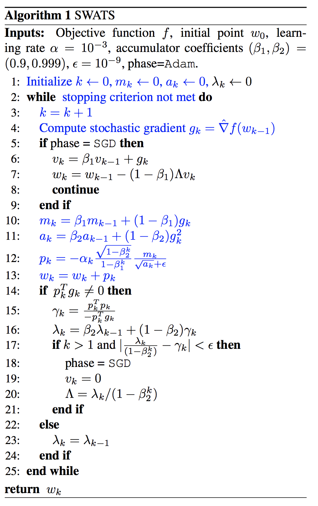
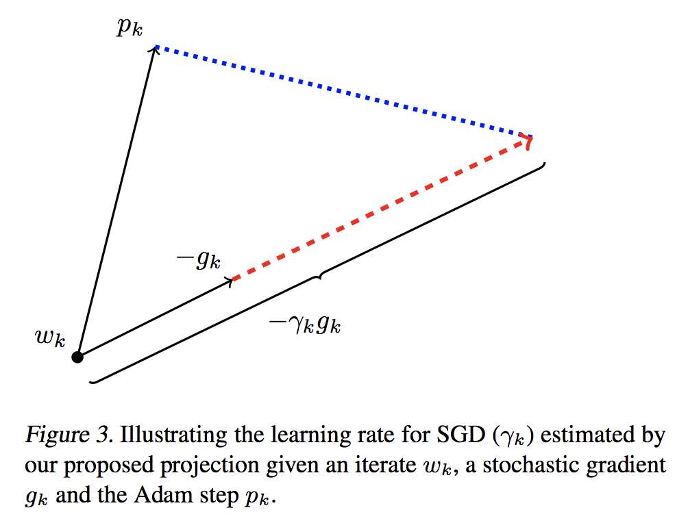

### Title

### Authors

### link
[Download link]()

### Contents
- 이전부터 보고되었던 이야기이지만 SGD에 비해 adaptive updating을 하는 방법들이 generalization이 잘안되는 현상이 있음
- 그런데 이런 경향이 있음에도 불구하고 adam같은건 보면 초기에는 학습이 SGD에 비해 빠름
- 그래서 이 논문 저자들은 걍 처음에는 adam같은 방식을.. 어느정도 학습이 된 후에는 SGD로 갈아타는 방식을 고안함
- 대신 그냥 대충 몇 step 지나면 바꾸기 이런게 아니고 언제 바꾸면 좋을지에 대해 아이디어를 고안했음
- Algorithm
    - 
    - sgd phase일 때는 update를 sgd rule에 맞춰서 하는데.. learning rate 구하는 방식이 독특(이후 설명)
    - adam phase일 때에는 그냥 adam에 맞게 parameter update만 하는게 아니고 adam phase로 넘어갈지 결정하는 transition prob과 learning rate도 계산
        - lambda(transition prob 비슷한 값) 구하는 논리를 좀 살펴보면.. adam과 비슷한 양만큼 sgd를 update해야한다면 sgd로,
        - 그렇지 않고 sgd로 update하는 값이 확 튀거나 그런 경우(scaling 문제나 이런거에 sgd는 약하니까 update 과정에서 fluctuation이 크거나 그런 경우를 생각해볼 수 있음)에는 adam을 이용해서 update를 하고 sgd mode는 꺼버림
        - gamma값이 어떻게 구해지는지 아래 그림을 보면 설명이 더 잘 이해감
        - 
- 여튼 이렇게 적절히 adam과 sgd를 섞어서 training을 했는데.. 솔직히 결과를 보면 걍 sgd를 쓰면 되는거 아닌지 의구심이 생김
- 딱히 여기서 말하는 방법을 쓴다고 해서 generalization error가 확 떨어지는 것도 아님
- 그렇다고 학습 속도가 기가 막히게 빨라지는 것도 아니고.. 요즘 머신들 싼데 걍 오래 돌리는거 생각하고 sgd 쓰는게 좋지 않을까?
- 찾아봐야 될 건 text data의 경우에도 sgd랑 adam이 차이가 많이 나는지 여부.. 조사해보자    