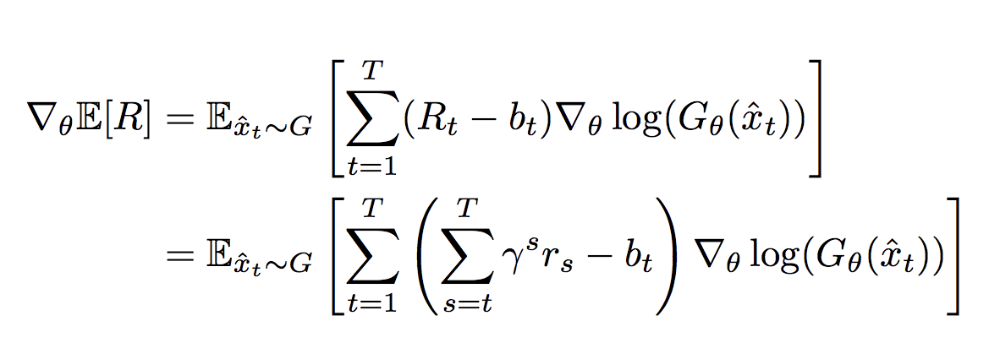
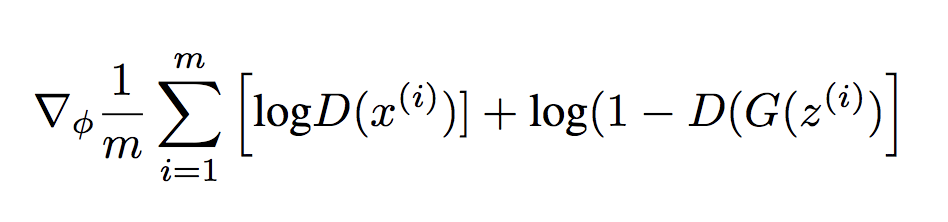

### Title
MASKGAN: BETTER TEXT GENERATION VIA FILLING IN THE Blank

### Authors

### link
[Download link](https://arxiv.org/pdf/1801.07736.pdf)

### Contents
- seq2seq model 학습 시에는 teacher forcing하는데 예측시에는 predicted value로 feeding하니까 결과가 안좋음
- 이거 극복하려고 scheduled sampling, professor forcing같은거 사용했는데..
    - 이거 문제점은 저렇게 넣기만 했고 loss function자체에 더 잘 생성하도록 하는 내용이 반영되지는 않았다는 점
- 자기 모델은 이렇게 만들었다고 주장
- gan을 어떻게 텍스트에 녹여냈는지 보는 데에는 도움이 많이 될 듯..
- MaskGAN
    - text의 일부를 blank token으로 교체(stochastically / deterministically)
    - decoding시에 masked sequence랑 이전 시점까지 decoder로 채워넣은 filled token 두 개를 다 이용해서 decoding
    - 이 부분이 generator 부분
    - discriminator는 똑같은 구조에 들어가는 자료가 좀 다름
        - generator에서는 masked token을 집어넣었지만 discriminator에는 original token 제공
        - 매 시점마다 지금 token이 생성된건지 원래 있던거인지 예측
    - 학습은 강화학습 형태로 이루어짐
    - reward는 discriminator가 주는 확률에 로그 값 취한거
    - generator update
    
    - policy gradient 사용했음. R-b(advantage)를 크게 하는 방향으로 G의 파라미터 update
    - discriminator update
    
    - 이건 뭐 그냥 토큰이 진짠지 가짠지 맞췄는지 보는 일반적 gan에서의 update방식
    - gan으로 generator를 학습할 때에 어떻게 gradient를 update할지가 상당히 난관인데(text자료는 softmax loss같은게 잘안됨...) 여기서는 rl framework 이용해서 그 문제를 우회한게 포인트라고 할 수 있을 것 같음
- 이걸 어떻게 번역 문제에 적용할 수 있을까?
    - 일단 masking은 필요없음..
    - generator 부분은 저런 식으로 update하면 될 것 같은데 discriminator 부분이 문제임..
    - 여기서는 realistic token이 생성되었는지 보는거니까 저렇게 하면 되지만 맥락에 맞는 token이 생성되었는지는 어떻게 판단한담?
    - source encoding해서 나온 text embedding을 보고 생성해낸 것이 괜찮은지 아닌지 판단하게 하면 되려나? 이게 잘 먹힌다면 바로 적용해볼 수 있을 것 같은데..
    - 이거 근데 너무 reward를 받을 수 있는 token이 한정적인 느낌인데...
    - 여기서도 그래서 sampled token을 이용해서 reward 구한게 아니라 모든 token에 대해 reward 구하고 token prob를 이용한 weighted mean을 썼음