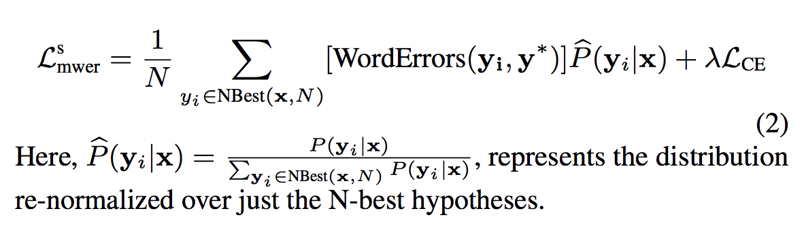
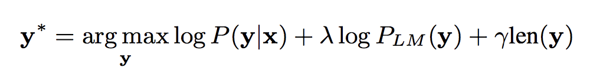

### Title
State-of-the-art speech recognition with sequence to sequence models

### Authors

### link
[Download link](https://arxiv.org/pdf/1712.01769.pdf)

### Contents
- 최신 구글 음성인식기술과 관련한 논문
- Listen, Attend and Spell 논문의 약간의 variation이 들어간 버전
- listener는 pyramidal attention을 이용해서(lstm -> 인접한 것끼기 concat해서 feature 수 줄인 encoder) log mel feature encoding
- attend and speller는 listener에서 나온 hidden feature가지고 lstm으로 grapheme 예측하는 모형
- 기본 골자는 그대로인데 성능이 기존 hybrid model보다 안나왔던 점을 개선했는데.. 어떤 방식을 썼을까?

- 사용한 방법들 정리
    - wordpiece models
        - 기존에는 target이 grapheme이었는데 wordpiece를 썼음
        - 짧은 decoding step과 그로 인한 lstm memory 효율적 사용, character 단위보다 낮은 perplexity
    - multihead attention
        - single head attention 사용하면 encoder에서 제공하는 context가 아주 informative해야되는데 multi head인 경우는 이러한 부담이 적어짐
        - cnn의 channel수와 비슷하게 생각할 수 있는 부분인 것 같은데.. transformer가 잘되는거 보면 잘될 것 같기도 하고 몰겠다
    - minimum word error rate training
        - 원래 las model은 cross entropy error를 줄이는 방식으로 학습했었음
        - 아니면 많은 모형들이 ctc error를 줄이는 방식으로 하거나
        - 근데 원래 평가 지표로 많이 사용하는건 wer(word error rate)임
        
        - 학습시에 mwer loss는 위와 같이 정의됨. NBest(x, N)은 N-beam search output
        - wer는 reference와 candidate를 token별로 align하고 levenstein distance 구하면 됨
        - 이거 약간 느낌이 강화학습 느낌이네.. wer이 reward고 p가 policy고..
    - scheduled sampling
        - 처음에는 teacher forcing하다가 나중에는 전 step에서 예측된 token을 넣어주도록 학습 과정을 변형, 1000000 step 넘어가면 sampling prob을 0.4로 고정
    - synchronous training
        - 이 부분은 reference를 읽고 보충하자...
    - label smoothing
        - cross entropy error 구할 때 random noise 섞고 renormalize
        - over-confidently predict하는 것 줄일 수 있다고 함
    - second-pass rescoring
        - 다른 5-grams으로 학습된 LM을 이용해서 beam-search해서 나온 candidate prob 보정
        
        - 더 많은 정보를 담은 LM을 이용해서 이상하게 예측된 결과 날려버릴 수 있음
- experimental detail에 보면 las모델처럼 pyramidal attention을 쓴게 아닌 것 같고 그냥 stacked lstm쓴 것 같은데.. 구조를 바꿨나?
- neural transducer도 봐야할 것 같음.. 여기선 streaming fashion으로 적용하는 것 같아서
