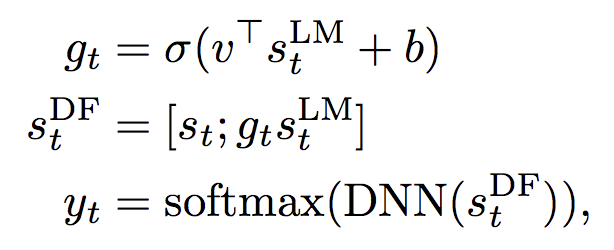

### Title
Cold Fusion: Training Seq2Seq Models Together with Language Models

### Authors

### link
[Download link](https://arxiv.org/pdf/1708.06426.pdf)

### Contents
- seq2seq model decoding시에 LM 이용하도록 하는 방법에 관한 논문
- speech recognition같은 과제에서 LM 이용한 guided beam search 많이 하는데 LM을 어떻게 하면 효과적으로 쓸 수 있을지에 대해 이야기하고 있음
- 여기서 말하는 shallow fusion은 p(y|x) + logLM(y)로 token prob를 보정하는 방법
- deep fusion은 아예 decoder의 hidden state값을 변화시킬 수 있도록 개조한 모형
    
- 이 논문 쓴 사람들은 seq2seq의 s_t는 LM independent하기 때문에 정보를 완전히 사용하지 않아서 불만족스럽다고 이야기하고 있음
- 고롬 cold fusion은 뭐냐?
    - seq2seq 모형 학습할 때 LM의 정보까지 함께 이용할 수 있도록 deep fusion 개조
    - 학습시에 LM의 state와 decoder state의 gate mechanism 만들어서 noisy input일 때에는 LM정보를 많이 이용할 수 있는 식으로 gate param 학습
    - LM의 hidden state를 p(y_t|y_...)으로 사용(n-gram prob)
- 아이디어가 엄청 심플하고 적용하기에도 좋은 것 같음.. 대신 concat때문에 parameter 학습해야하는게 한 몇 만개 더 늘어나는게 단점일 것 같긴 한데
- 여기서 말하는 shallow fusion보다는 더 좋은 결과를 내줄 것 같긴 함
- 한 번 실험해 볼 가치가 있을 것 같음// las + LM시에 이걸 적용해보면?