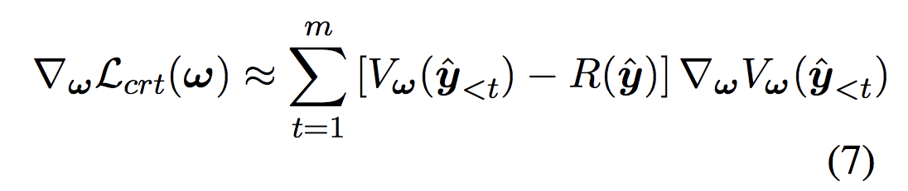

### Title
Reinforcement learning for bandit neural machine translation with simulated human feedback

### Authors

### link
[Download link](https://arxiv.org/pdf/1707.07402.pdf)

### Contents
- 이 논문은 음.. 내가 느끼기에는 아래의 2가지 측면을 다루고 있는 것 같음
    - 강화학습을 어떻게 하면 번역 문제에 잘 적용할 수 있을지
    - 강화학습의 reward로 사용되는 사람의 rating이 어떤 특성을 가지고 있고 이게 어떤 모형 학습에 어떤 영향을 미치는지
- 첫 번째 문제에 대해서는 이해가 쉽도록 쓰여있는데(사실 별로 새로운 내용은 아닌 것 같지만)
- 두 번째 내용에 대해서는 뭔가 미묘하게 구조화가 잘안된 느낌임. 왜 그렇게 느꼈는지는 아래에 추가적으로 이야기해보겠음

- 우선 강화학습 적용 부분부터 이야기를 하자면
    - 여기서는 a2c를 사용하는게 다른 강화학습 알고리즘보다 더 좋다고 이야기를 함
    - 그 근거는 아래와 같은데
        - 일반적으로 Q(s,a)를 근사하는 vanilla actor-critic은 action space가 너무 크기 때문에 high variance 문제에 빠지기 쉬움
        - 거기다가 a가 discontinue이기 때문에 관찰되지 않았더라도 비슷한 a에 대해 값을 잘 줄 수가 있다는 neural network로 Q function을 근사하는 것의 장점을 살리기가 어려움
        - V(s)는 이에 비해 variance가 작고 학습도 매 step의 reward가 굳이 필요없어서 좀 더 간단하게 됨
        - 여기서 V를 학습하는 방법
        
        - 저기서 R(y)는 이 논문에서는 BLEU였음
- 다음으로 보상에 관해 이야기를 하자면
    - 이 논문에서 지적하고 있는 문제는 좋은 것 같음
        1. 사람의 응답은 일반적으로 연속적이라기 보다는 likert scale같은걸 사용한, 혹은 좋다 싫다같은 granularity가 존재함
        1. 사람 응답은 일관성이 별로 없고 variance가 엄청나게 큼
        1. 사람 응답은 대체로 편향된(pessimistic / optimistic) 경향을 보임
    - 근데 그 다음이 좀 이상해짐
    - 그래서 이 사람들이 한 짓은 bleu로 학습했을 때의 개선도와 위의 3가지를 고려한 개떡버전 bleu로 학습시켰을 때의 개선도를 비교함
    - 그래서 개떡버전으로 학습한 것도 개선이 충분히 되는지를 봤음
    - 근데 제대로 된 비교를 하려면 실제 사람 응답 vs bleu를 비교해야하는거 아님?
    - 아니면 하다못해 cor(실제사람, bleu)와 cor(실제사람, 엉망(bleu))라도 제시를 해야하는거 아님?
    - 왜냐면 사람 응답은 확실히 bleu랑은 다르고 상관이 낮을 뿐더러
    - bleu자체는 저렇게 엉망으로 구해질 일이 없기 때문
    - 열심히 밑밥은 깔긴 했지만 그래도 최소한 내가 만든 엉망버전이 실제 사람의 응답을 잘 모사했다는 점을 보여줘야 논문 베이스가 더 탄탄해진다고 생각함
    
- 여튼 결론은 강화학습이 분명 mle로 학습한 baseline 모형을 향상시키는 부분이 있다는 점과 엉망 응답은 엉망 정도에 따라서 개선도가 많이 떨어진다는 점
- 그런데 결국 그래서 사람 응답이 좋은지 bleu를 쓰는게 좋은지는 모름.. 여기서는 그렇지 않을까?? 정도만 냄새만 풍김ㅋㅋㅋ 어쩌라는건지...