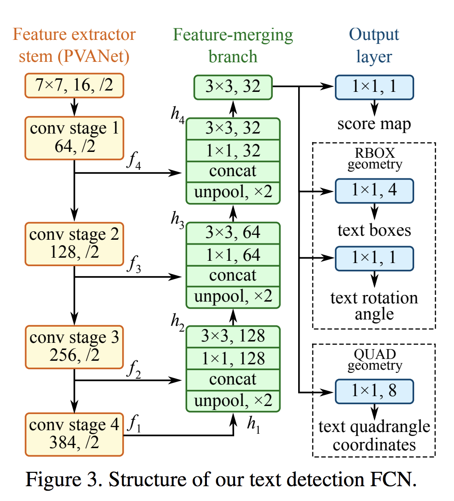
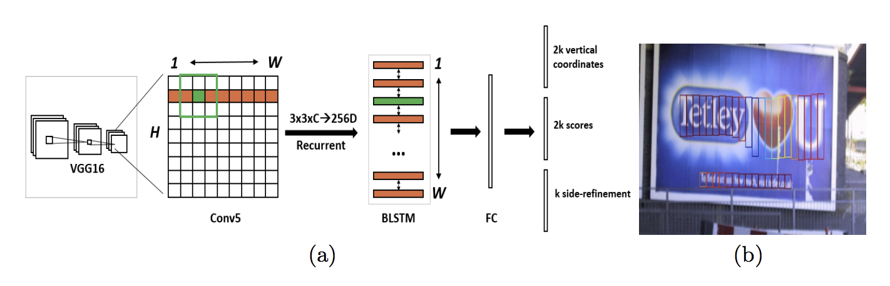
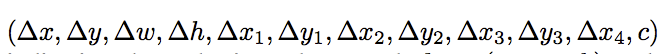
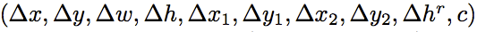
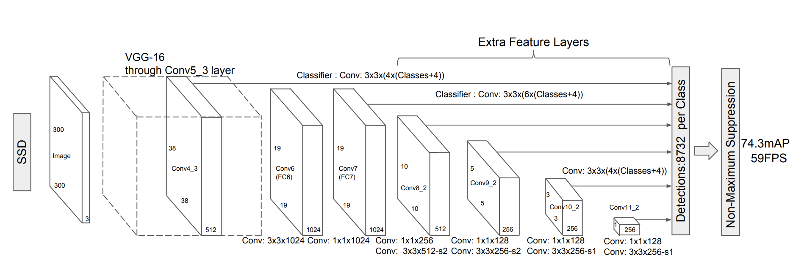
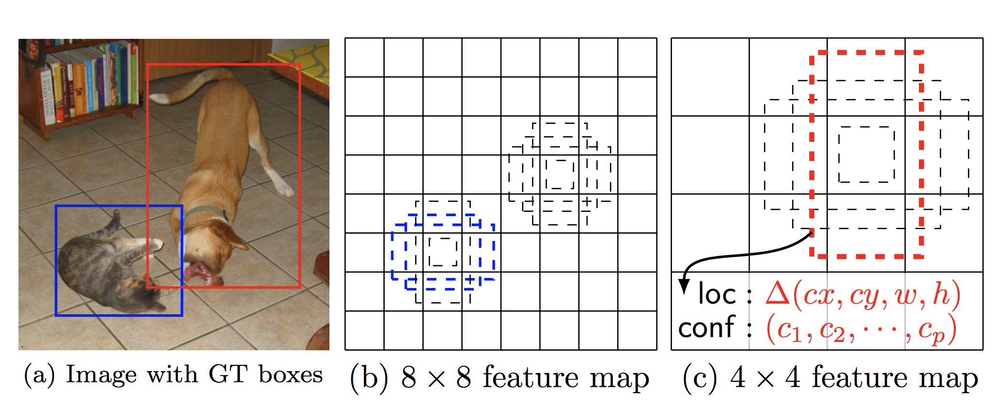

### Title
object recognition / detection 관련 논문 정리

### Authors

### link
[Download link]()

### Contents
- Faster R-CNN
    - r-cnn 구조는 그대로인데 앞단에 rpn(region proposal network)가 들어가서 roi proposal과 그 영역에 대한 object type classification이 한 번에 이루어지는 구조
    - 뒷 단에 r-cnn 구조는 cnn에서 나온 feature로 classifier 만드는거라 이전과 다를게 없음
    - 이 논문에서 중요하게 봐야 하는 부분은 region proposal network를 어떻게 만들었나 이거인듯
        - 우선 vggnet같은 cnn output을 각 feature map을 돌면서 n*n sliding을 하면서 각 위치마다 다시 low-dim feature extraction을 실시
        - cnn convolution map 결과가 30 * 20 이면 총 600개의 각 feature마다 256(vgg 사용시) dim의 feature가 나오는거
        - 이제부터는 여기서 뽑혀나온 feature를 가지고 anchor에 대해 classification / regression 실시
            - classification은 현재 특정 위치의 feature를 기반으로 다양한 anchor box에 대해 이정도 box면 object가 있다고 볼 수 있을지 없을지 예측하는 neural network
            - 
            - 현재 특정 위치의 feature들을 보고 어느정도 크기의 region box이면 background가 아닐지 보는거임
            - 저게 cnn 결과라서 그렇지 실제 이미지에서 저런 box들을 제안한다고 생각하면 좀 더 이해하긴 쉬울 듯
            - regression은 positive anchor box에 대해서만 적용하는데 실제 제안된 box가 너무 rough한 경우에 페널티를 먹여주기 위한걸로 생각해봐도 무방한 듯
            - 제안된 영역과 ground-truth 영역에서 x,y,h,w 네 개의 값을 계산하고 저게 얼마나 차이나는지로 loss를 계산
            - 그러면 너무 크게 영역잡거나 너무 작게 영역잡으면 loss가 확 커져버릴테니 적절한 size의 anchor를 고를 수 있게 되겠지
    - 기본적인 rpn의 구조는 이런 형태, 실제 활용할 때에는 feature map에서 원래 image로 projection해주는 복원장치가 있어야겠지
    - 내가 이전부터 착각하던게 이거였는데 나는 실제 image에서 roi proposal을 하는건 줄 알았는데 실제로는 그게 아니었음..

- EAST
    - 엄청 구조는 간단함, 크게 3부분으로 나눠서 볼 수 있음
    - 
    - feature extractor 부분은 low level부터 high level까지 다양한 feature를 뽑애낼 수 있는 cnn structure
        - pooling을 통해서 size 줄여가면서 더 넓은 receptive field에서 feature를 뽑아낼 수 있는 구조면 됨
    - feature merging 부분은 다양한 축척(??)의 conv feature를 하나로 합쳐가는 과정
        - 작은 size unpooling, 큰 사이즈와 channel dim으로 concat, 그 다음 다시 conv layer 통과시켜서 합쳐진 feature 재생성
    - output layer는 이제 두 부분으로 나눠진다고 볼 수 있음
        - 마지막으로 만들어진 convolution feature map의 각 feature마다 object인지 배경인지 구별해주는 score map
        - 그 다음 현재 위치로부터 어느 정도의 크기의 사각형이 object box인지 나타내주는 rbox geometry
        - 이건 모두 1channel, 4channel conv layer로 구현됨
    - score가 일정 이상인 feature만 찾아서 rbox의 값을 이용해서 사각형 그려주면 detection 끝

- MASK R-CNN
    - 

- YOLO
    - yolo 구조는 다른 어떤 모형보다 간단함
    - image를 cnn structure를 이용해 s * s feature map으로 변형(원 논문에서는 GoogleLeNet 사용했지만 굳이 그럴 필요도 없는 듯)
    - feature map의 각 cell마다 class prob과 bounding box confidence, boundary 예측
    - ssd는 많이라도 예측했는데 yolo는 한 번에 끝나버리니 속도 차이 많이 날 듯
    - EAST랑 비교해보자면 한 방에 끝내는건 똑같지만 yolo는 완전 coarse feature map으로 예측하는 반면 EAST는 unpool과정을 통해 좀 더 큰 feature map에서 한 방에 예측한다는 차이점
    
- Detecting Text in Natural Image with Connectionist Text Proposal Network
    - ctpn은 다른 one-shot 방법들과는 꽤 차이가 많이 남
    - 
    - vgg에서 나온 feature map을 row 3*3 conv에 넣은 다음 그 값들을 또 biLSTM에 태움
    - timestep마다 lstm output이 나오면 이 값들을 가지고 각 cell별로 k개의 anchor box에 대해 3가지를 예측함
        - anchor box의 center와 height 조절(vertical coordinates) -> 2k
        - anchor box의 text/nontext score -> 2k
        - side-refinement는 anchor box와 가까운 쪽의 (왼쪽 혹은 오른쪽) x coordinate
        - 저게 없으면 지나치게 이어붙이게 될 수 있음
    - 이거 장점이라고 한다면 중간에 glare나 이런게 있어서 feature가 이상할 때에도 주변 cell들의 도움을 받아서(rnn) 예측 정확도를 올릴 수 있을거란 점
    - 근데 단점은 bounding box의 width가 고정이라 힘들고 cell마다 높이가 다르거나 이럴 때 합치면 multi line에서 오차가 심할 수 있다는 점?
    
- textbox++
    - textbox는 ssd 구조를 완전 동일하게 사용했음
    - 다양한 사이즈의 feature map에서 예측하고 class channel이 binary라는거랑 default box가 옆으로 넓적한 것들로 설정되어 있다는 점만이 차이점..
    - textbox++는 여기에 약간의 변화를 준 모형인데..
        - 에측하는 점이 quadrilateral이거나 rotated rectangles일 때에 예측하는 점만 달라짐
        *******
        -  이건 quadrilateral일 때에
        *******
        -  이건 rotated rectangles일 때에
        *******
    - loss function은 계속 똑같이 쓰는데 location loss 부분을 어떤 box 쓰는가에 따라 좀 다르게 줘야 하지 않을까?

- pixellink

- R-FCN
    
- SSD
    - 이건 region proposal 단계를 없애서 r-cnn구조들에 비해 속도를 많이 향상시키는 것에 초점을 맞춘 그런 논문임
    - 그럼 어떻게 region proposal 단계를 없앴나? 그건 feature map과 feature map의 각 cell과 1:1 matching이 되는 default box의 관계로 결정이 됨
        - 
        - 우선 요 그림이 SSD의 기본 구조인데 pooling하면서 다양한 사이즈의 feature map을 만들어냄
        - 이 중 10*10 feature map을 하나 떼어놓고 생각을 해보자
        - 이 feature map에는 100개(10*10)의 cell이 있음
        - 그리고 각각의 cell에는 feature map의 특정 부분을 커버하는 default box가 있음(이건 미리 설정된 부분)
        - 그리고 각 cell에서는 3*3 kernel을 통해서 prediction을 실시
            - 위의 kernel에는 c+4개의 channel이 있음. c: # of classes, 4: default box를 어떻게 조절할지 결정해주는 값, dcx, dcy, dw, dh
            - 하나의 cell에서 k개의 default box를 사용한다면 각 cell마다 k(c+4)의 결과값이 나오게 되는거임
        - loss는 default box의 겹침정도를 나타내는 localization loss와 class 예측 정확도 나타내는 class confidence의 합으로 만들어짐
        - 
        - 이것도 feature map에서 예측된 box에서 raw image로 어떻게 projection하는지가 사실 확 와닿지는 않음
            - default box가 cx, cy, w, h를 raw image scale로 가지고 있는건가? 이 부분만 확인되면 끝인데.. 상식적으로는 아마 그럴 것 같긴 한데 코드에서 확인해보자