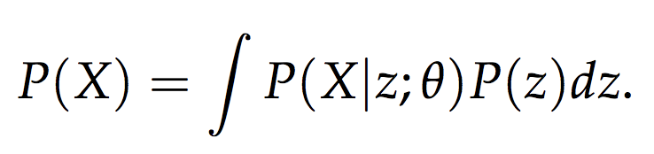

### Title
Tutorial on Variational Autoencoder

### Authors

### link
[Download link](https://arxiv.org/pdf/1606.05908.pdf)

### Contents
- vae는 기본적으로 latent variable 이용한 generative model임
- 
- p(z)는 latent variable의 prior
- p(X|z)는 likelihood function
    - 왜 이런 latent variable model을 쓸까?
    - 대부분의 high dimensional data는 뜯어보면 low dim manifold에 있는 경우가 많음
    - 그래서 low dim latent variable로 충분히 data를 잘 표상할 수 있음
- 일반적인 베이지안하고 느낌이 다른게 여기서부터 시작인데.. p(z)의 선택에 대해서는 큰 관심을 안두는 느낌. prior belief라는 점을 딱히 강조하지도 않음..
- p(X|z)도 cnn, rnn 같이 given z에 대해 확률적으로 값을 계산할 수 있는 뭔가이면 됨
- 사실 원 논문을 보면 p(X)에 초점이 맞춰져 있다기 보다는 좀 더 베이지안 관점에서 posterior, 즉 p(z|X)를 어떻게 만들어낼까에 좀 더 초점이 맞춰져 있는 것 같은 느낌이 든다
- posterior의 parameter를 추정하되 이 posterior는 X를 복원하기에 적합하게 정보를 많이 담고 있어야 한다는게 기본 골자
- 그러면 왜 학습때 sampling된 z를 사용하는지 이것도 명료해짐
    - 당연한건데 내 posterior가 정확한건지 알아보기 위해서는 z ~ p(z|x)에서 나온 z는 x에 대한 evidence를 충분히 담고 있어야 하기 때문
- 그리고 generation에서는 z ~ N(0, I)에서 뽑아서 decoder에 넣어줌
    - 만일 통제된(내가 원하는 attribute를 가진) sample을 뽑고싶다면 어떻게 해야하지?
    - 아마 이 부분이 conditional vae 부분인 것 같은데 추가로 읽어보기