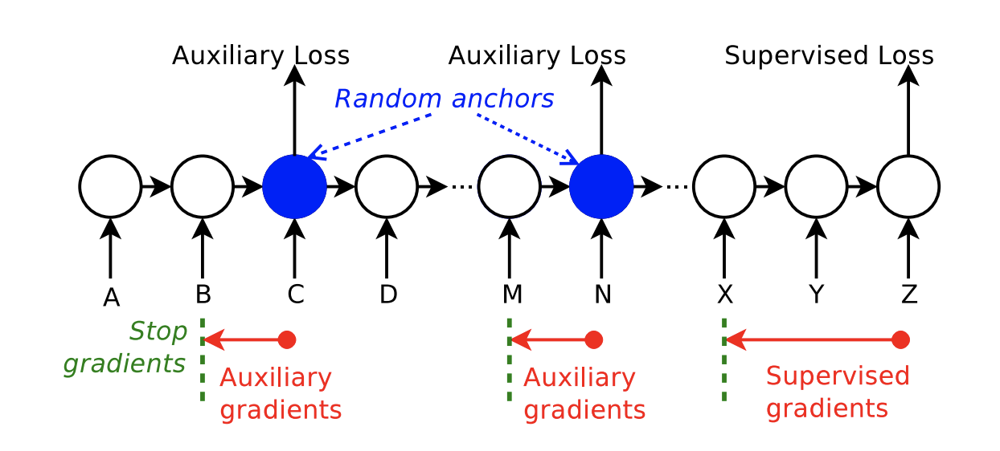

### Title
Learning Longer-term Dependencies in RNNs with Auxiliary Losses

### Authors

### link
[Download link](https://arxiv.org/pdf/1803.00144.pdf)

### Contents
- 뭔가 엄청 신통방통한 논문이라서 제대로 이해한건지 모르겠지만... rnn구조에서 엄청나게 긴 dependency를 학습할 수 있는 식의 loss를 추가하는 방법에 관한 논문
- 기존에는 gate mechanism / attention / skip connection같은게 주된 long-term dependency를 다루는 방법이었음
    - lstm이 선호받는 이유도 이것 때문
- 위의 방법들은 rnn의 구조 자체를 바꿔서 문제를 해결하려고 하는 쪽에 가까움
- 근데 이번에 이 사람들이 한 건 이런 기법들과는 완전히 연관없음
    - 직관적으로 보자면 모형 구조를 바꾸는 대신 lstm의 중간에서 기존 정보들이 잘 남아있는지 뒤돌아보면서 확인해보면서 넘어가는 loss를 추가했다고 볼 수 있음
        - 물론 이건 논문에서 나오는 r-lstm에만 해당하는 거지만 일단 이 방법이 성능이 더 좋으니..
- 
    - 원래 rnn이라면 마지막의 supervised loss가 sequence의 끝까지 타고 가면서 모형이 학습됨(BPTT)
    - 근데 여기서는 보면 중간에 끊겨있음(논문에서는 마지막 300step에만 supervised loss가 흐르게 했음)
    - 대신 중간에 임의의 anchor(그림에서는 c, n)를 만들고 이전 l step만큼의 정보를 이용해서(여기서는 b~c, m~n) 임의의 loss를 만들어냄
    - 저자들은 두 종류의 loss를 제안했음
        - 첫 번째는 reconstruction auxilliary loss
            - anchor의 hidden부터 시작해서 이전 l step의 값을 얼마나 잘 복원할 수 있는지 알아보는 loss
            - 아마도 제일 마지막까지 간 다음에 이전에 어떤 정보가 있었는지 모두 담아내는건 쉽지 않다는걸 인정하고.. 중간중간마다 잘하고 있제? 확인해보자는 그런 의도에서 만들어낸 것 같음
        - 두 번째는 prediction auxilliary loss
            - 이건 anchor의 hidden부터 시작해서 미래의 값을 예측해보는 loss
            - 미래를 내다볼 수 있다면 현재 값이 미래값을 잘 예측할 수 있도록 만들어주는게 의미가 있을지도... 근데 느낌적인 느낌으로는 r-lstm이 좀 더 그냥 사리에 맞는 것 같이 느껴짐..
    - 마찬가지로 두 loss모두 anchor로부터 l-step만큼만 gradient가 흐르도록 해줌
    - 여기서는 tf.stop_gradient를 사용했다고 하는데..
    - 아마 o, _ = tf.nn.dynamic_rnn(...); t = o[l:, :, :]; [tf.stop_gradient(x) for x in t]같은 느낌으로 되어야 할 듯?
        - 저 의사코드는 time_major일 때 기준임
- 실험 결과가 좀 놀라운데.. 그냥 기본 lstm보다 잘하는건 물론이고 비슷한 규모의 transformer와도 삐까치는 성능을 보여줌
- 그리고 엄청 긴 길이의 sequence에 대해서도 문제없이 학습할 수 있음
    - 이건 생각해보면 당연한게 gradient가 흐르는 부분은 sequence length에 관계없이 거의 constant로 유지되니까...(300 + n*l 정도...)
- 이 방법은 사실 모형 구조 바꾸는게 아니라 비슷한 rnn구조면 다 적용해볼 수 있다는게 큰 장점인 것 같음
- transformer에도 적용할 수 있나??
    - 저자들은 할 수 있을 거라는 느낌으로 이야기하긴 하는데 좀 생각해봐야 할 듯.. 만일 transformer에 적용하려면 restricted self attention을 먹여야 말이 되는거 아닐까?? 모르겠다
    
