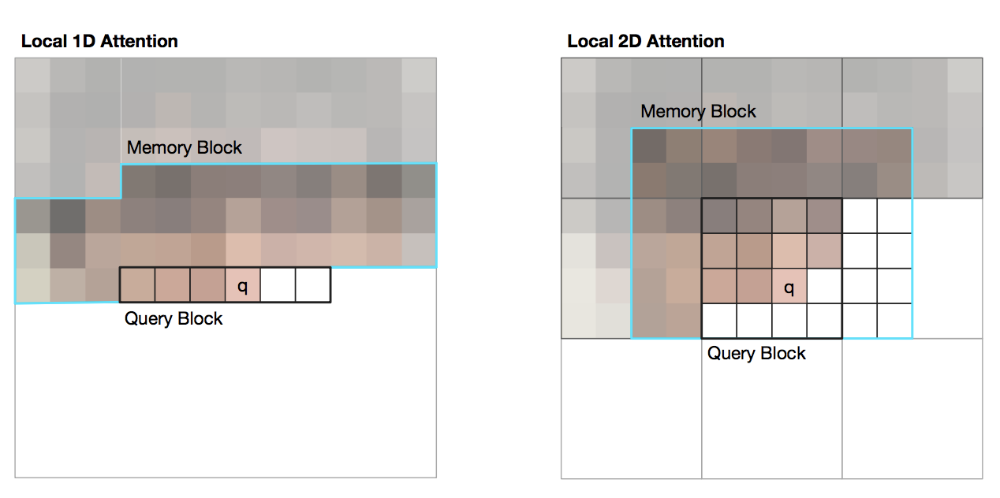
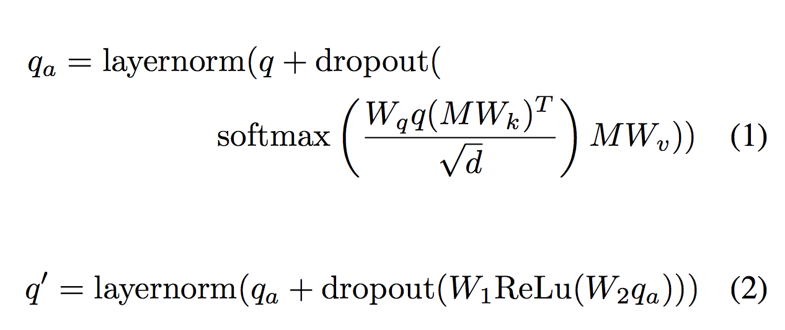

### Title
Image Transformer

### Authors

### link
[Download link](https://arxiv.org/pdf/1802.05751.pdf)

### Contents
- 사실 이번 논문 본건 image transformer에서 어떻게 ocr에 응용할 방법을 찾아볼까에 좀 더 초점이 맞춰져 있음
- image transformer는 self-attention을 image 장면에서도 그대로 응용한거라고 볼 수 있음
- 다만 몇 가지 점에서 차이가 나는데...
    - 우선 text와는 다르게 image는 sequence 길이가 훨씬 김
        - 32*32 image라도 sequence 길이가 1024니까... 일반 번역기 문제보다 거의 10배~20배정도는 길다고 볼 수 있을 것 같음
        - 이게 문제가 되는 이유는... multihead attention에서 query는 현재 시점 자료지만 memory랑 key는 전체 state matrix를 이용하는데.. 이걸 다 계산하는건 로드가 너무 많이 걸림
    - 다음으로 text는 1d이지만 image는 2d(width, height) 구조임
        - 현재 정보가 참고해야 하는 영역이 옆쪽으로만 이동해서 가려면... 너무 먼 거리를 이동해야 함(바로 위에거 보려고 해도 옆으로 가려면 한 width만큼의 step을 움직여야 함)
- 그래서 일반 transformer랑 다른 점이 몇 가지 생김
    - 우선 전체 context를 보는 대신 memory가 이미지의 일부만을 이용하는 local attention으로 번형이 됨
    - 
    - 그림에서 보는 것처럼 전체 이미지를 l개의 memory block으로 나눔
    - 그리고 각 self attention을 구할 때 memory는 query가 속한 것을 반복적으로 사용함
        - 이 방법을 통해서 memory block 부분에 들어가는 연산 수를 줄일 수 있음(pixel 수만큼에서 l개로)
    - 그리고 1-d, 2-d attention을 궁리를 했는데...
        - 1d는 그냥 옆으로 k개만큼 쭉 이동해서 자르는거
        - 2d는 grid 형식으로 자르는거
        - 물론 연산시에는 동일한 방법을 취하겠지만 memory안에 들어가는 자료 종류가 달라짐
        - 1d에서는 세로로 정보를 많이 담으려면 하여간 step이 커져야 하고 양옆으로 locality 약한 자료까지 포함되어야 하지만
        - 2d에서는 그런 문제가 적어짐
        - 이 효과는 이미지가 커질 때 더 유용할거라고 논문에서도 말하고 있음...
- 나머지 부분은 transformer랑 동일함
    - 
    - 저 q, M, M을 feature map을 그대로 써서 할 수 있지 않을까? ocr은 일단 지금 이미지 크기가 작으니까 그냥 해봐도 될 것 같은 느낌인데..
    - 사실 원래라면 저 q가 생성된 token vector여야 하겠지만.. feature map의 t번째 feature라고 치고 해버리면...
    - 일단 그렇게 한 번 테스트해보자
