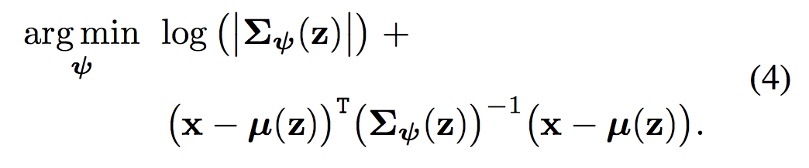

### Title
Structured Uncertainty Prediction Networks

### Authors

### link
[Download link](https://arxiv.org/pdf/1802.07079.pdf)

### Contents
- 일반적인 vae는 independent multivariate normal distribution을 가지고 모델링을 함...
- q(z|x) ~ N(mu, sigma*I)
- 그래서 보통 어떻게 하냐면... 학습 때에는 x -> mu, sigma 뽑아내고.. reparametrization trick을 써서 z를 만든 다음
- p(x|z)로 다시 그림 복원을 함
- 근데 생각해보면... x 사이에는 어떤 covariance structure가 존재함
- 그럼 decoder p(x|z)는 복원할 때 z에 대해 independent 구조이면 안되는거 아님?
- p(x|z)의 likelihood를 아래와 같이 만들면... 더 좋아질거야
- 
- 여기서는 몇 가지 트릭을 사용
    1. covariance matrix 대신 inverse인 precision matrix를 모델링
        - multivariate normal의 log likelihood 구할 때 inverse 필요함
        - log(det(cov)) = -log(det(inv(cov))) 라서 log determinant는 간단히 구해짐
    1. any symmetric matrix -> cholesky decomposition 가능
    1. 거기다가 sparse cholesky decomposition 이용
        - 그래도 n(n-1)/2 + n개 다 예측하는건 힘들고..
        - 이미지의 모든 픽셀이 correlated 되어 있다고 생각할 필요는 없으니... 가까이 있는 몇 개 픽셀 사이만 nonzero로 두고 예측
- 실제 실험 결과를 보면 image의 어떤 covariance structure를 비슷하게 잘 모사하는 것처럼 보임
- 보통은 q distribution에 많이 신경을 쓰는데 여기서는 간만에 decoder의 likelihood에 신경쓰는걸 봤네
- 근데 왜 진작에 이런 생각을 안했을까 궁금할 정도로 당연한 이야기인데....
- 이미지는 근데 h, w가 있어서 cov matrix를 저것보다는 좀 더 다른 모양으로 만들면 좋을 것 같구... 모르겠다..