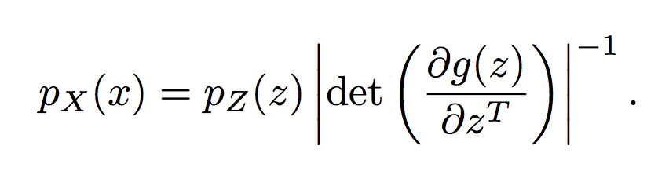
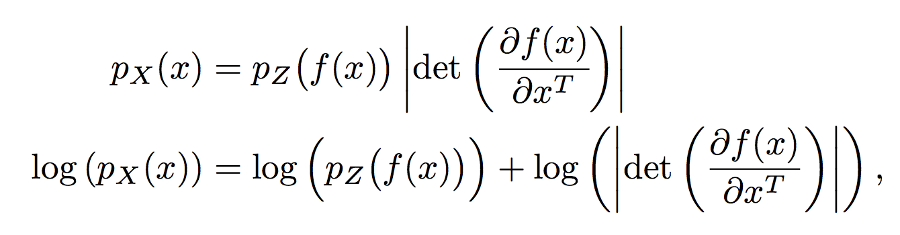
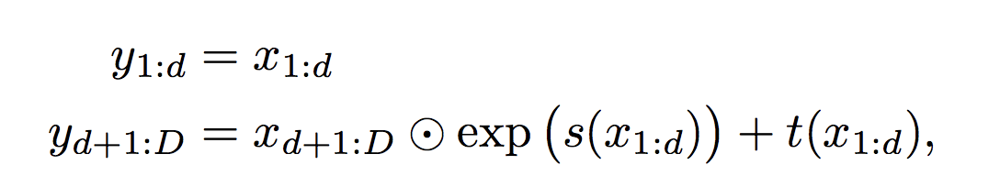

### Title
Density Estimation Using Real NVP

### Authors

### link
[Download link](https://arxiv.org/pdf/1605.08803.pdf)

### Contents
- RealNVP의 식을 보면 결국 같은걸 하는데.. 방향이 반대인 걸로 적혀있음
    - 이게 우리가 일반적인 NF에서 접하는 식..
    - 
    - 그리고 이게 RealNVP에서 z를 이용하여 x의 distribution을 나타내는 법
    - 
    - g : z -> x인 bijector이고 f = inv(g)이면 f(x) = z니까 아래처럼 적을 수 있음. 결국 다 같은 말...
    - z의 입장에서 계산되냐 x의 입장에서 계산되냐 그 차이 정도...
    
- 근데 z -> x로 가는 jacobian 계산 쉽고 bijector인 어떤 transformation은 구하기 쉬웠지만 그 반대로도 계산이 쉬운 transformation은 있었나?
    - RealNVP가 그렇게 만든 transformation을 제안한거임
    - 그걸 가능하게 하는게 coupling layer임
    - iaf를 생각해보면 determinant가 계산이 편하려면 autoregressive한 스타일이면 됨(jacobian: lower triangular matrix)
    - 예를 들어 이렇다고 해보자... y1 = ax1 + b, y2 = ax2 + bx1 + c
    - 그럼 y로의 계산은 parallel하게 가능하지만 y에서 x로 돌아오는 (x -> z)로의 방향은 parallel할 수가 없음
        - 왜냐면 y2의 역함수를 구할 때 x1이 필요한데 x1은 y1에서 구해져야 하니까 결국 앞의 계산이 필요한 sequential한 절차가 되기 때문
    - RealNVP에서는 이 문제를 일부는 그냥 transformation없이 유지하는걸로 해결함
        - 그럼 y2에서 x2를 구할 때 x1이 필요한건 x1 = y1이므로 바로 y1을 넣어주면 되고 그럼 y에서 x로 가는 것도 parallel하게 가능하게 됨
    - 식을 살펴보면, D dim vector인 x를 y로 변환하는 과정은 아래와 같고
        - 
    - 이러면 일부분은 안바뀌게 되니 저런 bijector를 쌓아서 그 전에 안바뀐 녀석들은 다음번에 바뀔 수 있도록 만들어줌
    - s, t는 신경망에서 나오는 값
    
- 이와는 별개로 이미지에 적용하는 부분에서 저걸 masked convolution으로 해결하는 부분과 batch normalization 이용하는게 나오는데.. 중요한 팁이긴 한데 flow 만드는 부분과는 크게 상관은 없는 부분...
