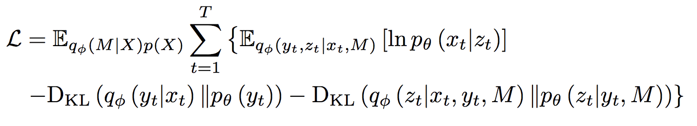

### Title
The Kanerva Machine: A Generative Distributed Memory

### Authors

### link
[Download link](https://arxiv.org/pdf/1804.01756.pdf)

### Contents
- 한 줄 요약을 하자면... vae의 메모리 적용판이라고 볼 수 있음
    - vae에서는 p(x) ∝ p(x|z)p(z), p(z)는 q(z|x)로 모델링됨
    - 이 kanerva machine에서는 p(x) ∝ p(x|z)p(z|y, M)p(y) 이렇게 됨
    - p(z|y, M) ~ N(z|t(w)*M, σ2 * I)
    - 저렇게 하는게 무슨 이익이 있을까?
        - 기본적으로는 hierarchical model의 이점을 그대로 가지고 있다고 볼 수 있음
        - z를 만들어낼 때, 다양한 x의 정보를 그대로 활용할 수 있음
        - 만일 새로운 패턴의 데이터가 들어오거나 학습 데이터가 적은 경우에도 충분히 대처 가능

- The Original Kanerva Machine
    - Kanerva machine은 distributed memory 가설을 가지고 만든 메모리 모형
    - 각 데이터는 unique address 가지고, 내가 메모리의 어떤 정보들을 참고해야 할지는 address 간 거리를 기반으로 계산됨
    - read시에는 거리가 특정 threshold 넘은 memory address에 해당하는 값의 평균으로
    - write시에는 address 거리가 특정 threshold 넘은 곳에 additive하게... M_k <- M_k + x for address k which is near to current address of data x
    
- Objective Function
    - 
    - M은 전체 데이터 X에 대해 한 번만 나오는거니까 저렇게 밖으로 나와있는거고... given M일 때 안에 들어있는거는 
        - 첫 번째 부분은 일반적으로 보는 reconstruction loss
        - 두 번째 부분은 memory address 구하는 부분은 posterior
        - 세 번째는 memory retrieval의 posterior
        
- iterative sampling
    - inference할 때 모형 거쳐서 나온 x_hat을 다시 모형에 집어넣어서 새롭게 예측하는걸 반복함
    - 자기들도 증명은 안하고 대략 느낌만 이야기하는데 y_t를 만들 때 memory를 참조를 안하니까... memory를 참조해서 만든 x_hat을 넣어서 다시 address 뽑으면 점차적으로 메모리에서 내가 뽑아야 하는 애들을 잘 뽑아낼 수 있을거

- 근데 식은 뭐 저렇게 어떻게 보면 심플하게 적혀있는데... 실제로 어떻게 코드로 짜서 학습 돌려야할지는 꽤 막막하네..
- vae랑 많이 안다른 것 같기도 하고... 몰겠당