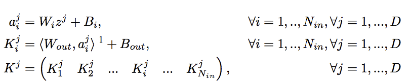
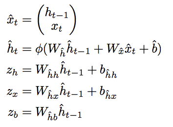
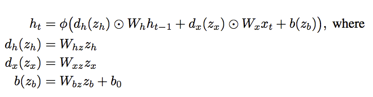

### Title
HyperNetworks

### Authors

### link
[Download link](https://arxiv.org/pdf/1609.09106.pdf)

### Contents
- 어디에 써먹으려고 만들었을까... 처음엔 그런 생각이 드는 논문이기도 하지만..
- 이 논문은 제목에서도 알 수 있듯 어떤 primary network의 parameter를 만들어 내는 hypernetwork에 관한 논문임
- 아마도 초기값을 정하거나 할 때 써먹을 수도 있을 것 같고...
- 그런 잡이야기는 일단 제쳐두고.. 이 논문에서는 두 가지 hypernetwork를 제시함
    1. static hypernetwork
        - static hypernetwork는 cnn용
        - conv2d kernel을 생각하면 k*k*c_in*c_out만큼의 parameter를 만들어 내야함
        - 뭘 기반으로 만들어내느냐?
            - 각 conv layer를 대표하는 embedding z를 일단 만들어 냄
            - 그리고 W = g(z)를 통해 W를 만들어 냄. 당연히 g는 hypernetwork이겠지??ㅋ
            - 하나의 z로부터 고정된 channel size의 kernel이 나온다
            - 그러면 서로 다른 kernel size를 다루려면 어떻게 해야하나? conv layer가 필요한 만큼 여러개의 embedding z를 가지고 있으면 됨
            - z_l1 = (z_11, z_12, ..., z_1n) 이런 느낌. 그럼 각 z_ij 마다 kernel을 만들어서 합쳐주면 됨
        - 자세한 식은 아래와 같음
        - 
        
    1. Dynamic hypernetwork
        - dynamic hypernetwork는 좀 더 특이함
        - 일단 static hypernetwork는 layer들이 고정이니까 layer embedding을 만들어서 쓸 수 있었지만 여기서는 아님
        - 그래서 z_t를 만들어 내는 rnn hypernetwork가 존재하고 여기서 나온 매 timestep별 z_t를 가지고 main rnn network의 W_z, W_x를 만들어 냄
        - 이렇게 하면 그냥 rnn이랑은 다르게... 매 스텝마다 weight sharing이 안됨. 장점인지 단점인지는 모르겠지만ㅋㅋ
        - 
        - 
        - weight 만들어내는 공식은 위와 같음
        - 여기서 lstm의 normalization과의 연관성을 이야기하는데... 그러게 저게 input sample마다도 다르다는건 좀 특이한 점인 듯
- 이제 성능 비교를 하는데 small network에서 parameter 만들어내니까 확실히 # of params가 적음
- 근데 성능도 별로 차이가 없음...
- 넘모넘모 신기한데 이걸 정말 써먹을 수 있는걸까?
