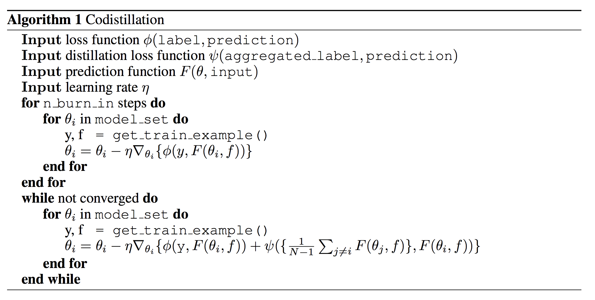

### Title
Large Scale Distributed Neural Network Training Through Online Distillation

### Authors

### link
[Download link](https://arxiv.org/pdf/1804.03235.pdf)

### Contents
- gpu가 너무 많아서 효율이 떨어질 때 distillation을 효율적으로 하는 방법에 대한 논문(-_-..)
- 
- 알고리즘은 위와 같은데... 엄청 심플함
- 일단 burn-in stage에서는 각 모형들을 어느정도 성능이 나올 때까지 각자 학습
- 그 다음 codistillation 부분에서는 loss에다가 distillation loss를 합쳐서 학습
- 이 방법이 기존 distillation하고 뭐가 다르냐?
    - 일단 기존 distillation에서는 teacher network 부분이 학습이 끝난 상태이고 고정
    - 그리고 model structure는 student network하고 달라도 상관없었음
        - 오히려 복잡한 모형인 경우가 많았지...
    - 근데 codistillation은
        - 각 모형의 구조는 동일하고 teacher network임과 동시에 student network임
        - 실시간으로 계속 teacher network도 업데이트가 됨
        
- 이건 그래서 distillation보다는 오히려 distributed training에 가까운 느낌이라고 볼 수 있는데 이것과 다른 점은
    - distributed training에서는 각 모형에서 gradient 정보를 받는데 여기선 prediction 결과를 받음
    - asynchronous training에서의 stale gradient 문제보다는 stale prediction이 훨씬 문제가 적고(ensemble과 비슷한 효과, 반면 gradient 정보는 완전 딴 방향으로 갈 가능성 있어서 훨씬 위함)
    - synchronous training에 비해서 gpu 늘릴 때의 결과물이 훨씬 나음
    
- 또한 distillation과는 다르게 모형 구조가 다 동일하니까 예측치 가져올 때에도 자기 모형에서 weight만 남의 것 불러와서 결과물 받아오면 되니까 훨씬 더 간단함
- parameter server와 통신하는 부분 이런데서의 병목이 훨씬 줄어들어서 시간 효율적
- 다 좋은데 저기서처럼 gpu 256개 쓰는거 아닌 이상 저런 고민을 하는게 의미가 있나 싶다...