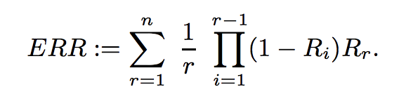

- Learning to Rank Algorithm
    - Basic Idea: ranking is transformed into a pairwise classification or regression problem
    - ranknet
        - p_ij = exp(si - sj) / 1 + exp(si - sj), where s_i: score(q, doc(i))
        - loss function은 ground truth 확률과 실제 확률의 cross entropy로
        - 다만 저 score si를 만들어 내는 함수는 어떻게 만들어지는지는 자세히 말을 안해줌...
        - 경우에 따라선 sim(q, d)가 될 수도 있겠고... p(q|d) / p(d|q) 등등 다양하게 될 수 있겠지
        - 여튼 저 확률을 direct로 update하는게 아니고 rank에 따라 update한다는 점에서 이익은 있겠지만... 학습 자료가 없음..
        
        
- metrics
    - Basic Idea
        - model that rank more relevant document higher is better
        
    - Mean Reciprocal Rank
        - 정답 document가 내가 만들어 낸 ranking에서 몇 번째에 위치하는지를 기반으로 평가
        - 예시
            - q: cat, proposed results: pet, dog, kitten, answer: kitten, reciprocal rank: 1/3
            - q: dog, proposed results: pet, dogs, cat, answer: dogs, reciprocal rank: 1/2
            - MRR: (1/3 + 1/2)/2 = 5/12
            
    - Normalized Discounted Cumulative Gain
        - 여기서 gain은 각 문서의 query와의 일치도라고 생각하면 됨
        - 근데 discounted는 왜 붙었을까?
            - ranking에서는 user에게 제시되는 정보가 순서가 지어져있기 때문에.. 같은 document set을 제시하더라도 더 높은 gain을 가진 문서가 더 위에 제시되는게 좋기 때문
            - 따라서 가까이 있는거에 더 가중치를 주고 ranking이 떨어지는건 유사도가 높다고 해도 적게 반영하는 것이 맞음
            - 
            - 위에서 Z는 각 query별 normalizing constant이고 뒷 부분은 분자는 score, 분모는 위치정보에 기반한 discount factor
            
    - Expected Reciprocal Rank
        - 위에서는 위치 정보를 가지고 discount를 했는데...
        - 단순히 뒤에 있다고 사람들이 안보는건 아님
        - 앞쪽에 정답이 없으면 쉽게 다음 doc으로 넘어가는데 앞쪽에 정답같은게 있으면 바로 거기서 클릭하고 다음으론 안넘어감
        - 이러한 유저의 행동을 반영하여 discounting을 하자는게 expected reciprocal rank의 기본 아이디어
        - 
        - 여기서 Ri는 i번째에서 클릭할 확률, R_i = 2^score(doc(i)) - 1 / 2^max_score({doc})
        - 개념적으로 보자면 ERR은 expected click position = E(p(user stop at position t))인데....
        - 앞에서 엄청 relevant한 문서가 나와버리면 뒤에는 좋은게 나오든 안나오든 상관없음. 결국 위의 다른 metric보다 처음에 얼마나 더 relevant한게 나오느냐에 초점을 둔 metric