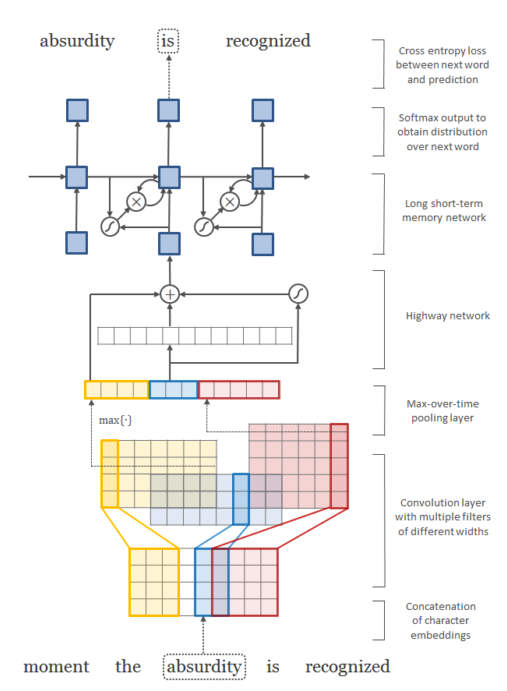

### Title
Character-Aware Neural Language Models

### Authors
Yoon Kim, Yacine Jernite, David Sontag, Alexander M. Rush

### link
[Download link](https://arxiv.org/pdf/1508.06615.pdf)

### Contents
1. Introduction
    - neural language model은 count based model보다 더 성과가 좋았지만 morphologically rich language에서는 문제가 되는 경향이 있었음
    - 왜냐하면 같은 뜻을 지닌 단어라도 다양한 형태로 쓰여서 각각의 출현 빈도(혹은 확률)은 낮아질 수 밖에 없었기 때문
    - cnn이용해서 morphological tagging이 필요없는 모형 만들기
    - 결과물 영어에서는 적은 파라미터로 거의 비슷한 성능, 형태소가 다양한 언어에서는 baseline모형 뛰어넘음
    
1. Model
    - 
    - 전통적 방식의 word embedding 들어갈 자리에 character level cnn 집어넣어서 embedding 만들어 냄
    - the input at time t is an output from a character-level cnn
    - length of word: l = [c_1, ..., c_l]
    - character embedding: 여기서는 one-hot encoding안하고 d-dim으로 차원축소해서 집어넣음
    - width w짜리 kernel: character w-gram 효과
    - max-over-time pooling
    - kernel width 여러개 사용해서 나온 output concatenation -> rnn의 input으로 사용
    - input을 바로 집어넣기도 했지만 highway network 사용해서 변환하기도 함(여기를 embedding layer로 바꾸면 어떨까?)
        - discussion에 보면 highway layer 이전에는 형태가 비슷한 것끼리(edit distance 가까운 형태) 인접해 있었다면 highway network를 통과한 이후에는 semantically similar word가 근처에 있음 -> word embedding과 비슷한 효과
    
1. Discussion
    - highway network를 통한 변환은 비슷한 단어가 근처에 있도록 만들어 줌
    - kernel들이 morpheme을 잘 포착하는 경향이 있음
